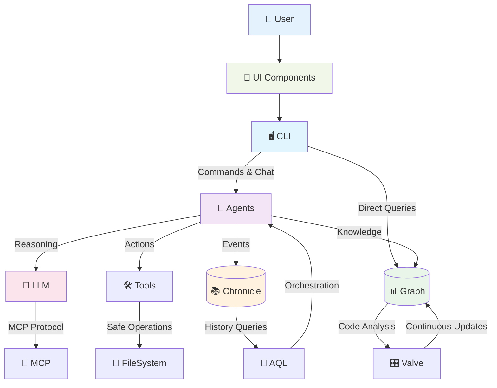

# 📚 SAGE Documentation Hub

Welcome to the comprehensive documentation for **SAGE** — *"A Codebase is a Living Society."*

This hub provides structured access to all SAGE documentation, organized for different audiences and use cases.

## 🎯 Quick Navigation

### 🏠 **New to SAGE?** Start Here
1. **[📜 The Manifesto](./core-concepts/Manifesto.md)** — Understand the vision and philosophy
2. **[🧠 Core Principles](./core-concepts/Principles.md)** — Learn the constitutional doctrines  
3. **[📖 Lexicon](./core-concepts/Lexicon.md)** — Master the shared vocabulary
4. **[🚧 Project Status](../README.md#-project-status)** — Current development state and roadmap

### 👥 **Different Audiences, Different Paths**

#### 🆕 As a New Contributor
*"I want to understand this project and contribute effectively."*
1. [📜 The Manifesto](./core-concepts/Manifesto.md) — The why behind SAGE
2. [🧠 Principles](./core-concepts/Principles.md) — The rules we follow
3. [📖 Lexicon](./core-concepts/Lexicon.md) — The language we speak
4. [🔄 Onboarding Workflow](./guides/Onboarding-Workflow.md) — How to join the society
5. [🧪 Testing & Development](./guides/Relay.md) — How to build and test

#### 🖥️ As a CLI User
*"I want to use SAGE to enhance my development workflow."*
1. **[🚧 Current Status](../README.md#-project-status)** — Check development progress
2. **[💬 Chat Interface Design](../apps/cli/README.md)** — Understand the planned interface
3. **[📊 Analysis Architecture](./guides/Instant-Recall.md)** — Learn the analysis approach
4. **[🔍 Query Language](../packages/aql/README.md)** — Explore the planned workflows

#### 🤖 As an Agent Developer  
*"I want to create or customize SAGE agents."*
1. [📋 Contracts](./architecture/Contracts.md) — The agent interface specifications
2. [🏛️ Architecture Overview](#-architecture-overview) *(see diagram below)*
3. [🎭 Archetypes](#-the-archetypes) — Available agent types
4. [🛠️ Agent Development](../packages/agents/README.md) — Build custom agents

#### 🔧 As a Package Developer
*"I want to contribute to or extend SAGE's core packages."*
1. [🏗️ Package Standards](./Package-Standards.md) — Follow our conventions
2. [📋 Individual Contracts](./architecture/Contracts.md) — Per-package specifications  
3. [🧪 Testing Framework](../packages/test-utils/README.md) — Our testing infrastructure
4. [🔄 Development Workflow](./guides/Relay.md) — Build, test, and release

---

## 🏛️ Architecture Overview

**Core Data Flow:**
- **CLI** provides the human interface to the society
- **Agents** orchestrate reasoning and action using specialized archetypes
- **Graph** maintains the ground truth of code structure and relationships
- **Chronicle** preserves the complete history of all interactions
- **LLM** provides natural language understanding via multiple providers
- **Tools** enable safe, sandboxed operations on code and files

---

## 🎭 The Archetypes

SAGE's society consists of six specialized consciousnesses, each with distinct roles:

| Archetype | Role | Key Responsibilities |
|-----------|------|---------------------|
| **[🧙 Sage](./archetypes/Sage.md)** | *The Mind* | Strategic reasoning, plan creation, high-level orchestration |
| **[🛡️ Guardian](./archetypes/Guardian.md)** | *The Soul* | Code quality, consistency, protecting project integrity |
| **[📚 Librarian](./archetypes/Librarian.md)** | *The Custodian* | Data management, search, information retrieval |
| **[⚔️ Warden](./archetypes/Warden.md)** | *The Shield* | Security, access control, permission management |
| **[👥 Delegator](./archetypes/Delegator.md)** | *The Executor* | Task execution, workflow orchestration, delegation |
| **[📝 Archivist](./archetypes/Archivist.md)** | *The Memory* | Event logging, history preservation, continuity |

---

## 📋 Core Concepts Reference

### 🧠 Philosophy & Principles
- **[📜 The Manifesto](./core-concepts/Manifesto.md)** — Core vision and problem statement
- **[🧠 Principles](./core-concepts/Principles.md)** — Constitutional doctrines governing the society
- **[📖 Lexicon](./core-concepts/Lexicon.md)** — Shared vocabulary and definitions

### 📐 Technical Specifications  
- **[📋 Contracts](./architecture/Contracts.md)** — Agent and package interface contracts
- **[🔐 Vault-Warden Protocol](./architecture/Vault-Warden-Protocol.md)** — Security and permissions
- **[🎛️ Valve Configuration](./architecture/Valve.md)** — Perceptual apparatus setup

### 🔄 Processes & Workflows
- **[🚀 Onboarding Workflow](./guides/Onboarding-Workflow.md)** — Project initialization
- **[🧪 Relay System](./guides/Relay.md)** — Testing and development
- **[💾 Instant Recall](./guides/Instant-Recall.md)** — Memory and state management

---

> **🚨 Bullet Wound Invariant**
>
> Enforcement of the [Principle of Integrity](./core-concepts/Principles.md#5-principle-of-integrity). If a [Guardian](./archetypes/Guardian.md) detects contradiction between its Chronicle and the [Code Graph](./core-concepts/Lexicon.md#code-graph), it must invoke `HALT_AND_REPORT`, freezing execution until reconciliation.
>
> **[➡️ See formal definition in Lexicon](./core-concepts/Lexicon.md#bullet-wound-invariant)**

---

---

## 🚀 Applications & Packages

### 🖥️ Applications
- **[CLI](../apps/cli/README.md)** — *"The Bridge to the Society"* — Primary human interface
- **[Valve](../apps/valve/README.md)** — *"The Perceptual Valve"* — Configurable awareness system

### 📊 Status Matrix

| Package | Status |
|---------|--------|
| **[agents](../packages/agents/README.md)** |  |
| **[aql](../packages/aql/README.md)** |  |
| **[chronicle](../packages/chronicle/README.md)** |  |
| **[graph](../packages/graph/README.md)** |  |
| **[llm](../packages/llm/README.md)** |  |
| **[mcp](../packages/mcp/README.md)** |  |
| **[test-utils](../packages/test-utils/README.md)** |  |
| **[tools](../packages/tools/README.md)** |  |
| **[ui](../packages/ui/README.md)** |  |
| **[utils](../packages/utils/README.md)** |  |

### 📦 Core Packages
- **[agents](../packages/agents/README.md)** — *The Society of Minds* — Core archetype logic
- **[graph](../packages/graph/README.md)** — *The Ground Truth* — Commit-addressable knowledge graph  
- **[chronicle](../packages/chronicle/README.md)** — *The Sacred Memory* — Append-only event logging
- **[llm](../packages/llm/README.md)** — *The Engine of Thought* — Multi-provider LLM interface
- **[aql](../packages/aql/README.md)** — *The Declarative Orchestrator* — Agent Query Language

### 🛠️ Supporting Packages
- **[mcp](../packages/mcp/README.md)** — *The Universal Translator* — Model Context Protocol
- **[tools](../packages/tools/README.md)** — *The Hands of the Agents* — Sandboxed operations
- **[ui](../packages/ui/README.md)** — *The Voice of the System* — Shared React components
- **[test-utils](../packages/test-utils/README.md)** — *The Controlled Environment* — Testing infrastructure
- **[utils](../packages/utils/README.md)** — *The Foundation* — Core utilities and helpers

---

## 🤝 Contributing

Ready to join the society? Here's how:

1. **📖 Read the Philosophy:** Start with [The Manifesto](./core-concepts/Manifesto.md) and [Principles](./core-concepts/Principles.md)
2. **🔍 Explore the Codebase:** Browse the source to understand the emerging structure  
3. **🧪 Set Up Development:** Follow the [Relay System](./guides/Relay.md) for testing
4. **🎯 Find Your Role:** Choose your contribution path from the [audiences](#-different-audiences-different-paths) above
5. **🚀 Start Contributing:** Follow our [Package Standards](./Package-Standards.md) and contracts

---

*Generated by SAGE — A Codebase is a Living Society*