# 🌟 SAGE Documentation (QWEN Optimized)

*Generated on 2025-08-29T23:56:52.398Z - Optimized for QWEN (28,412/32,000 tokens)*

**SAGE** — *"A Codebase is a Living Society."*

This document contains the highest-priority documentation files, optimized for QWEN's 32,000-token context limit.

**Note**: 29 lower-priority files were omitted due to context limits.

## 📋 Table of Contents

### 🏠 Core
- [🏠 Main Project README](#main-project-readme) *(653 tokens)*

### 📚 Documentation
- [📚 Documentation Hub](#documentation-hub) *(1874 tokens)*
- [📚 Documentation: Archivist](#documentation-archivist) *(1182 tokens)*
- [📚 Documentation: Delegator](#documentation-delegator) *(994 tokens)*
- [📚 Documentation: Guardian](#documentation-guardian) *(955 tokens)*
- [📚 Documentation: Librarian](#documentation-librarian) *(836 tokens)*
- [📚 Documentation: Sage](#documentation-sage) *(723 tokens)*
- [📚 Documentation: Warden](#documentation-warden) *(838 tokens)*
- [📚 Documentation: Contracts](#documentation-contracts) *(2027 tokens)*

### 🖥️ Applications
- [🖥️ App: cli (README)](#app-cli-readme) *(583 tokens)*
- [🖥️ App: valve (README)](#app-valve-readme) *(1615 tokens)*

### 📦 Packages
- [📦 Package: agents (README)](#package-agents-readme) *(1277 tokens)*
- **aql** *(4028 tokens total)*
  - [📦 Package: aql (README)](#package-aql-readme) *(922 tokens)*
  - [📦 Package: aql (examples/README)](#package-aql-examples-readme) *(1616 tokens)*
  - [📦 Package: aql (examples/experiments/README)](#package-aql-examples-experiments-readme) *(1490 tokens)*
- [📦 Package: chronicle (README)](#package-chronicle-readme) *(1141 tokens)*
- [📦 Package: graph (README)](#package-graph-readme) *(1048 tokens)*
- [📦 Package: llm (README)](#package-llm-readme) *(1043 tokens)*
- [📦 Package: mcp (README)](#package-mcp-readme) *(1140 tokens)*
- [📦 Package: test-utils (README)](#package-test-utils-readme) *(1308 tokens)*
- [📦 Package: tools (README)](#package-tools-readme) *(1370 tokens)*
- [📦 Package: ui (README)](#package-ui-readme) *(1360 tokens)*
- [📦 Package: utils (README)](#package-utils-readme) *(1247 tokens)*

### 📄 Other
- [📄 fixtures › README.md](#fixtures-readme-md) *(356 tokens)*

---

🏛️ # 📚 Documentation Hub

> **📁 Source File:** `DOCS/README.md` • *157 lines, 1874 tokens* • Hash: `d5c20506`

# 📚 SAGE Documentation Hub

Welcome to the comprehensive documentation for **SAGE** — *"A Codebase is a Living Society."*

This hub provides structured access to all SAGE documentation, organized for different audiences and use cases.

## 🎯 Quick Navigation

### 🏠 **New to SAGE?** Start Here
1. **[📜 The Manifesto](./core-concepts/Manifesto.md)** — Understand the vision and philosophy
2. **[🧠 Core Principles](./core-concepts/Principles.md)** — Learn the constitutional doctrines  
3. **[📖 Lexicon](./core-concepts/Lexicon.md)** — Master the shared vocabulary
4. **[🚧 Project Status](../README.md#-project-status)** — Current development state and roadmap

### 👥 **Different Audiences, Different Paths**

#### 🆕 As a New Contributor
*"I want to understand this project and contribute effectively."*
1. [📜 The Manifesto](./core-concepts/Manifesto.md) — The why behind SAGE
2. [🧠 Principles](./core-concepts/Principles.md) — The rules we follow
3. [📖 Lexicon](./core-concepts/Lexicon.md) — The language we speak
4. [🔄 Onboarding Workflow](./guides/Onboarding-Workflow.md) — How to join the society
5. [🧪 Testing & Development](./guides/Relay.md) — How to build and test

#### 🖥️ As a CLI User
*"I want to use SAGE to enhance my development workflow."*
1. **[🚧 Current Status](../README.md#-project-status)** — Check development progress
2. **[💬 Chat Interface Design](../apps/cli/README.md)** — Understand the planned interface
3. **[📊 Analysis Architecture](./guides/Instant-Recall.md)** — Learn the analysis approach
4. **[🔍 Query Language](../packages/aql/README.md)** — Explore the planned workflows

#### 🤖 As an Agent Developer  
*"I want to create or customize SAGE agents."*
1. [🏛️ Architecture Overview](#-architecture-overview) *(see diagram below)*
2. [📋 Contracts](./architecture/Contracts.md) — The agent interface specifications
3. [🎭 Archetypes](#-the-archetypes) — Available agent types
4. [🛠️ Agent Development](../packages/agents/README.md) — Build custom agents

#### 🔧 As a Package Developer
*"I want to contribute to or extend SAGE's core packages."*
1. [🏗️ Package Standards](./Package-Standards.md) — Follow our conventions
2. [📋 Individual Contracts](./architecture/Contracts.md) — Per-package specifications  
3. [🧪 Testing Framework](../packages/test-utils/README.md) — Our testing infrastructure
4. [🔄 Development Workflow](./guides/Relay.md) — Build, test, and release

---

## 🏛️ Architecture Overview

```mermaid
graph TB
    User[👤 User] --> UI[🎨 UI Components]
    UI --> CLI[🖥️ CLI]
    CLI --> |"Commands & Chat"| Agents[🤖 Agents]
    CLI --> |"Direct Queries"| Graph[(📊 Graph)]
    
    Agents --> |"Reasoning"| LLM[🧠 LLM]
    Agents --> |"Actions"| Tools[🛠️ Tools]
    Agents --> |"Events"| Chronicle[(📚 Chronicle)]
    Agents --> |"Knowledge"| Graph
    
    LLM --> |"MCP Protocol"| MCP[🔗 MCP]
    Tools --> |"Safe Operations"| FS[📁 FileSystem]
    Graph --> |"Code Analysis"| Valve[🎛️ Valve]
    Chronicle --> |"History Queries"| AQL[📝 AQL]
    
    Valve --> |"Continuous Updates"| Graph
    AQL --> |"Orchestration"| Agents
    
    style User fill:#e3f2fd
    style UI fill:#f1f8e9
    style CLI fill:#e1f5fe
    style Agents fill:#f3e5f5
    style Graph fill:#e8f5e8
    style Chronicle fill:#fff3e0
    style LLM fill:#fce4ec
```



**Core Data Flow:**
- **CLI** provides the human interface to the society
- **Agents** orchestrate reasoning and action using specialized archetypes
- **Graph** maintains the ground truth of code structure and relationships
- **Chronicle** preserves the complete history of all interactions
- **LLM** provides natural language understanding via multiple providers
- **Tools** enable safe, sandboxed operations on code and files

---

## 🎭 The Archetypes

SAGE's society consists of six specialized consciousnesses, each with distinct roles:

| Archetype | Role | Key Responsibilities |
|-----------|------|---------------------|
| **[🧙 Sage](./archetypes/Sage.md)** | *The Mind* | Strategic reasoning, plan creation, high-level orchestration |
| **[🛡️ Guardian](./archetypes/Guardian.md)** | *The Soul* | Code quality, consistency, protecting project integrity |
| **[📚 Librarian](./archetypes/Librarian.md)** | *The Custodian* | Data management, search, information retrieval |
| **[⚔️ Warden](./archetypes/Warden.md)** | *The Shield* | Security, access control, permission management |
| **[👥 Delegator](./archetypes/Delegator.md)** | *The Executor* | Task execution, workflow orchestration, delegation |
| **[📝 Archivist](./archetypes/Archivist.md)** | *The Memory* | Event logging, history preservation, continuity |

---

## 📋 Core Concepts Reference

### 🧠 Philosophy & Principles
- **[📜 The Manifesto](./core-concepts/Manifesto.md)** — Core vision and problem statement
- **[🧠 Principles](./core-concepts/Principles.md)** — Constitutional doctrines governing the society
- **[📖 Lexicon](./core-concepts/Lexicon.md)** — Shared vocabulary and definitions

### 📐 Technical Specifications  
- **[📋 Contracts](./architecture/Contracts.md)** — Agent and package interface contracts
- **[🔐 Vault-Warden Protocol](./architecture/Vault-Warden-Protocol.md)** — Security and permissions
- **[🎛️ Valve Configuration](./architecture/Valve.md)** — Perceptual apparatus setup

### 🔄 Processes & Workflows
- **[🚀 Onboarding Workflow](./guides/Onboarding-Workflow.md)** — Project initialization
- **[🧪 Relay System](./guides/Relay.md)** — Testing and development
- **[💾 Instant Recall](./guides/Instant-Recall.md)** — Memory and state management

---

## 🚀 Applications & Packages

### 🖥️ Applications
- **[CLI](../apps/cli/README.md)** — *"The Bridge to the Society"* — Primary human interface
- **[Valve](../apps/valve/README.md)** — *"The Perceptual Valve"* — Configurable awareness system

### 📦 Core Packages
- **[agents](../packages/agents/README.md)** — *The Society of Minds* — Core archetype logic
- **[graph](../packages/graph/README.md)** — *The Ground Truth* — Commit-addressable knowledge graph  
- **[chronicle](../packages/chronicle/README.md)** — *The Sacred Memory* — Append-only event logging
- **[llm](../packages/llm/README.md)** — *The Engine of Thought* — Multi-provider LLM interface
- **[aql](../packages/aql/README.md)** — *The Declarative Orchestrator* — Agent Query Language

### 🛠️ Supporting Packages
- **[mcp](../packages/mcp/README.md)** — *The Universal Translator* — Model Context Protocol
- **[tools](../packages/tools/README.md)** — *The Hands of the Agents* — Sandboxed operations
- **[ui](../packages/ui/README.md)** — *The Voice of the System* — Shared React components
- **[test-utils](../packages/test-utils/README.md)** — *The Controlled Environment* — Testing infrastructure
- **[utils](../packages/utils/README.md)** — *The Foundation* — Core utilities and helpers

---

## 🤝 Contributing

Ready to join the society? Here's how:

1. **📖 Read the Philosophy:** Start with [The Manifesto](./core-concepts/Manifesto.md) and [Principles](./core-concepts/Principles.md)
2. **🔍 Explore the Codebase:** Browse the source to understand the emerging structure  
3. **🧪 Set Up Development:** Follow the [Relay System](./guides/Relay.md) for testing
4. **🎯 Find Your Role:** Choose your contribution path from the [audiences](#-different-audiences-different-paths) above
5. **🚀 Start Contributing:** Follow our [Package Standards](./Package-Standards.md) and contracts

---

*Generated by SAGE — A Codebase is a Living Society*

---

🚀 # 🏠 Main Project README

> **📁 Source File:** `README.md` • *63 lines, 653 tokens* • Hash: `1dfa235a`

# SAGE

> **"A Codebase is a Living Society."**

SAGE transforms your codebase into a living ecosystem of specialized AI agents that understand, protect, and evolve your code alongside you.

## 🚧 Project Status

SAGE is currently **under active development**. The vision is real, the architecture is sound, but we're still building the society.

**What's Working:**
- Core philosophy and architectural patterns
- Graph-based code analysis foundation
- Agent archetype designs

**Coming Soon:**
- Production-ready CLI installation
- Full agent implementation
- Live codebase interaction

Want to contribute or stay updated? Check out our [Contributing Guide](./DOCS/README.md#-contributing) or explore the codebase to understand the vision.

## 🎭 What Makes SAGE Special

- **🧙 Living Agents:** Six specialized AI archetypes (Sage, Guardian, Librarian, Warden, Delegator, Archivist) each with distinct roles
- **📊 Code Graph:** Your entire codebase mapped as queryable relationships, not just text
- **📚 Perfect Memory:** Every interaction and change is remembered and can inform future decisions
- **🛡️ Built-in Protection:** Agents actively guard against inconsistencies and breaking changes
- **🎯 Contract-First:** Every component has explicit behavioral guarantees

## 📖 Documentation

**📚 [Complete Documentation Hub](./DOCS/README.md)** — Start here for comprehensive guides

**Quick Links:**
- [📜 The Philosophy](./DOCS/core-concepts/Manifesto.md) — Why SAGE exists and what it solves
- [🧠 Core Principles](./DOCS/core-concepts/Principles.md) — The rules that govern the society
- [📖 Lexicon](./DOCS/core-concepts/Lexicon.md) — Learn the shared vocabulary
- [🚀 CLI Guide](./apps/cli/README.md) — Master the primary interface

## 🏗️ Key Packages

| Package | Purpose | Status |
|---------|---------|---------|
| **[agents](./packages/agents/README.md)** | The society of specialized AI minds | 🚀 Production |
| **[graph](./packages/graph/README.md)** | Code knowledge representation | 🚀 Production |  
| **[llm](./packages/llm/README.md)** | Multi-provider AI interface | 🚀 Production |
| **[chronicle](./packages/chronicle/README.md)** | Immutable event history | 🚀 Production |
| **[aql](./packages/aql/README.md)** | Agent query language | 🔄 Active Development |
| **[mcp](./packages/mcp/README.md)** | Model Context Protocol | 🚀 Production |

## 🤝 Contributing

Join the living codebase! Read the **[Documentation Hub](./DOCS/README.md)** for contribution guidelines, architecture overview, and development setup.

## 📄 License

MIT

---

*SAGE • A Codebase is a Living Society*


---

🖥️ # 🖥️ App: cli (README)

> **📁 Source File:** `apps/cli/README.md` • *37 lines, 583 tokens* • Hash: `009f60e0`

# SAGE CLI

**"The Bridge to the Society."**

This application is the primary human-machine interface for the SAGE Framework. It is a powerful, interactive command-line tool that serves as the entry point for all developer-initiated conversations, commands, and workflows. It is the bridge through which a developer speaks to the collective consciousness of their codebase.

### Current Role

In its current form, this application is a comprehensive monolith containing the logic for UI, state management, LLM interaction, and agent-like behaviors. It is the proof-of-concept for the entire SAGE experience, orchestrating everything from the `sage ask` chat interface to the `sage ingest` analysis command.

### The Refactor Plan: A Great Extraction

The destiny of this application is to become a lean, powerful orchestrator. Its intelligence and capabilities will not be diminished; instead, they will be extracted into dedicated, reusable packages within the monorepo. This "great extraction" will make the system more modular, testable, and scalable.

- **UI Components & Rendering Logic** will move to `@sage/ui`.
- **Agent Tools (`Bash`, `GraphQuery`, etc.)** will move to `@sage/tools`.
- **The core logic for all SAGE agents** will be formalized in `@sage/agents`.
- **LLM interaction and prompt management** will move to `@sage/llm`.
- **Reading/writing to Chronicle files** will be handled by `@sage/chronicle`.

### Future Role: The Orchestrator

> **AQL integration (planned):** the CLI will expose `sage aql run <file.aql>` to
> compile and execute AQL queries against the active provider (` @sage/llm`) with
> streaming output and tool-call confirmation.

After the refactor, the `cli` will have one clear purpose: to orchestrate the collaboration between the user and the SAGE agents.

When a user runs `sage ask`, this application will:

1.  Instantiate the `Sage` agent from `@sage/agents`.
2.  Provide it with capabilities from `@sage/tools`.
3.  Power its reasoning with `@sage/llm`.
4.  Render the entire interaction using components from `@sage/ui`.

It will manage the high-level workflows and protocols—like Plan/Approve/Delegate and Reconciliation—but the deep logic for _how_ those protocols work will live in the dedicated packages. Its complexity will decrease as the power of the ecosystem increases.


---

🖥️ # 🖥️ App: valve (README)

> **📁 Source File:** `apps/valve/README.md` • *193 lines, 1615 tokens* • Hash: `e3689fa3`

# SAGE Valve Implementation

This package contains the **Rust implementation** of the SAGE Valve, the perceptual apparatus for the SAGE framework.

For a complete conceptual overview of the SAGE Valve, its philosophy, and its role in the SAGE ecosystem, please see the primary documentation:

**➡️ [Main Documentation: The SAGE Valve](../../DOCS/Valve.md)**

---

## Development & Testing

This document provides practical guidance for developers working on the Rust application.

### Testing Tips and Gotchas

Here's a comprehensive guide to testing in the SAGE Valve project, covering the challenges we've encountered and how to avoid them.

#### 1. Configuration File Testing

**Challenge**: The `ValveConfig::load_from_repo` function expects the configuration file to be located at `.sage/valve.yml` relative to the repository root.

**Solution**: Always create the `.sage` directory and place the configuration file within it:

```rust
let temp_dir = TempDir::new().expect("Failed to create temp directory");
let sage_dir = temp_dir.path().join(".sage");
std::fs::create_dir_all(&sage_dir).expect("Failed to create .sage directory");
let config_file = sage_dir.join("valve.yml");
fs::write(&config_file, config_str).expect("Failed to write config file");
```

**Footgun**: Forgetting to create the `.sage` subdirectory will result in a "missing config" error.

#### 2. Path Canonicalization Issues

**Challenge**: The `Registry::add` method canonicalizes paths using `canonicalize()`, which can lead to path comparison issues in tests.

**Solution**: Always compare canonicalized paths with canonicalized paths:

```rust
assert_eq!(codebase.path, test_path.canonicalize().unwrap());
```

**Footgun**: Comparing a canonicalized path with a non-canonicalized path will fail even if they refer to the same location.

#### 3. Directory Creation Before Adding to Registry

**Challenge**: The `Registry::add` method requires the path to exist and be canonicalizable.

**Solution**: Always create directories before adding them to the registry:

```rust
let test_path = temp_dir.path().join("test_project");
std::fs::create_dir_all(&test_path).expect("Failed to create test directory");
let codebase = registry.add(&test_path).expect("Failed to add codebase");
```

**Footgun**: Trying to add a non-existent directory will result in an "Invalid argument" error.

#### 4. UUID-based Registry Entries

**Challenge**: Each call to `Registry::add` creates a new entry with a unique UUID, even for the same path.

**Solution**: When testing removal by path, understand that it removes the first matching entry, not all entries:

```rust
// Add two codebases with the same path
let codebase1 = registry.add(&test_path).expect("Failed to add codebase");
let codebase2 = registry.add(&test_path).expect("Failed to add codebase");

// Remove by path (removes only the first match)
let removed = registry.remove_by_id_or_path(test_path.to_str().unwrap()).expect("Failed to remove codebase");
assert!(removed.is_some());

// The second entry still exists
let removed2 = registry.remove_by_id_or_path(&codebase2.id).expect("Failed to remove codebase");
assert!(removed2.is_none()); // This will fail because the entry still exists
```

**Footgun**: Assuming that adding the same path twice and then removing by path will remove both entries.

#### 5. Shared Registry Testing

**Challenge**: Testing the `SharedRegistry` requires understanding how `Arc` references work.

**Solution**: Use `std::ptr::eq` to compare `Arc` references:

```rust
let registry = Registry::load_or_default().expect("Failed to load registry");
let shared_registry = SharedRegistry::new(registry);
let shared_registry_clone = shared_registry.clone();

// Both should point to the same data
assert!(std::ptr::eq(shared_registry.0.as_ref(), shared_registry_clone.0.as_ref()));
```

**Footgun**: Trying to access fields of the `Arc` directly using dot notation (e.g., `shared_registry.0 .0`) will result in compilation errors.

#### 6. Persona Matching Tests

**Challenge**: Testing persona matching requires creating valid configuration files with proper syntax.

**Solution**: Use raw string literals for YAML configuration and ensure proper indentation:

```rust
let config_str = r#"
personas:
  TestWatcher:
    filters: ["**/*.txt"]
    triggers: ["test"]
"#;
```

**Footgun**: Incorrect YAML indentation or missing newlines can cause parsing errors.

#### 7. Test Environment Isolation

**Challenge**: Tests that modify global state or filesystem locations can interfere with each other.

**Solution**: Use `tempfile::TempDir` to create isolated test environments and set environment variables as needed:

```rust
let temp_dir = TempDir::new().expect("Failed to create temp directory");
std::env::set_var("HOME", temp_dir.path());
```

**Footgun**: Tests that share the same HOME directory or registry file can interfere with each other.

#### 8. Test Cleanup

**Challenge**: Tests that create files or modify system state should clean up after themselves.

**Solution**: Use RAII patterns with `TempDir` which automatically cleans up when it goes out of scope:

```rust
#[test]
fn test_something() {
    let temp_dir = TempDir::new().expect("Failed to create temp directory");
    // Test code here
    // temp_dir is automatically cleaned up when it goes out of scope
}
```

**Footgun**: Manually created temporary files that aren't cleaned up can accumulate and cause test failures.

#### 9. Regex Escaping in Tests

**Challenge**: Regex patterns in configuration files need to be properly escaped when used in raw strings.

**Solution**: Use double backslashes for regex patterns in YAML:

```rust
let config_str = r#"
personas:
  TestWatcher:
    filters: ["**/*.rs"]
    triggers: ["fn\s+main"]  # Note the double backslash
"#;
```

**Footgun**: Forgetting to escape backslashes in regex patterns will result in invalid regex errors.

#### 10. Test Coverage Strategy

To ensure comprehensive test coverage:

1. **Unit Tests**: Test individual functions and methods in isolation
2. **Integration Tests**: Test how modules work together
3. **Edge Cases**: Test error conditions and boundary cases
4. **Happy Path**: Test the expected normal flow
5. **State Management**: Test how state changes over time

### Running Tests

To run all tests:

```bash
cargo test
```

To run tests with output:

```bash
cargo test -- --nocapture
```

To run a specific test:

```bash
cargo test test_name
```


---

📄 # 📄 fixtures › README.md

> **📁 Source File:** `fixtures/README.md` • *40 lines, 356 tokens* • Hash: `85cad77b`

# SAGE Contract Fixtures

This directory contains normative fixtures that define the **exact** expected behavior for SAGE package implementations. Each fixture provides concrete input/output pairs that serve as the authoritative specification.

## Structure

- `canonical-json/` - JSON canonicalization and hashing fixtures
- `chronicle-events/` - Chronicle event serialization and ID computation
- `graph-schema/` - Graph queries with expected results
- `sha256/` - SHA256 hashing test vectors

## Usage

Contract implementers must ensure their code produces **bit-perfect** matches with these fixtures. No ambiguity about whitespace, key ordering, or hash encoding.

### Example: Canonical JSON

```ts
import { canonicalJSONStringify } from "@sage/utils";
import fs from "fs";

const input = JSON.parse(fs.readFileSync("fixtures/canonical-json/input.json"));
const expected = fs.readFileSync("fixtures/canonical-json/output.txt", "utf8");
const expectedHash = fs.readFileSync(
  "fixtures/canonical-json/output.sha256",
  "utf8"
);

const result = canonicalJSONStringify(input);
assert.strictEqual(result, expected);
assert.strictEqual(sha256(result), expectedHash);
```

## Adding New Fixtures

1. Create descriptive directory names that match contract acceptance tests
2. Provide both input and expected output files
3. Include hash/checksum files where determinism is critical
4. Update this README with usage examples


---

📦 # 📦 Package: agents (README)

> **📁 Source File:** `packages/agents/README.md` • *165 lines, 1277 tokens* • Hash: `0c9c01ff`

# @sage/agents

> "The Society of Minds."

## Overview

This package implements the core logic for SAGE's archetypal agents — **Sage, Guardian, Warden, Delegator, Archivist**. These agents are specialized consciousnesses that embody SAGE's constitutional principles and protocols, negotiating Plans with evidence from the **Code Graph** and **Chronicles**.

### Relationship with SAGE Valve

Agents are activated by the **[SAGE Valve](../../apps/valve/README.md)**, which detects relevant changes in the codebase and triggers agents through Persona configurations.

## Installation

```bash
pnpm add @sage/agents
```

## Quick Start

```typescript
import { Guardian } from "@sage/agents";

// Create a Guardian agent for a specific file
const guardian = new Guardian({
  filePath: "/src/UserService.ts",
  graph: graphClient,     // @sage/graph for code understanding
  chronicle: chronicleClient, // @sage/chronicle for memory
  tools: toolRegistry,    // @sage/tools for safe operations
  llm: llmClient         // @sage/llm for reasoning
});

// Review a proposed change plan
const decision = await guardian.reviewPlan(plan);
if (decision.type === "deny") {
  console.log(`Change denied: ${decision.reason}`);
} else {
  console.log(`Change approved: ${decision.justification}`);
}
```

## Core API

### Guardian

Reviews proposed changes to its file and enforces architectural principles.

```typescript
interface IGuardian {
  reviewPlan(plan: Plan): Promise<Approve | Deny>;
  reconcile(edit: RogueEdit): Promise<ReconciliationOutcome>;
  selfInquiry(): Promise<SelfInquiryReport>;
  bulletWoundCheck(assertions: Assertion[]): Promise<void>; // may HALT_AND_REPORT
}
```

### Delegator

Executes approved Plans atomically within a transaction boundary.

```typescript
interface IDelegator {
  execute(plan: Plan): Promise<ExecutionReport>;
}
```

### Warden

Reviews infrastructure changes and manages environment policies.

```typescript
interface IWarden {
  reviewPlan(plan: Plan): Promise<Approve | Deny>;
  promote(build: BuildRef, from: Env, to: Env): Promise<PromotionResult>;
  postMortem(incident: Incident): Promise<PostMortemReport>;
}
```

### Sage

Ideates solutions and mediates between conflicting agent reviews.

```typescript
interface ISage {
  ideate(input: Intent): Promise<Ideation>;
  draftPlan(ideation: Ideation): Promise<Plan>;
  mediate(reviews: ReviewSet): Promise<MediationResult>;
}
```

### Archivist

Records and queries the historical lineage of files and directories.

```typescript
interface IArchivist {
  record(event: LineageEvent): Promise<void>;
  query(q: HistoryQuery): Promise<HistoryAnswer>;
}
```

## Key Protocols

### Bullet Wound Invariant
When a Guardian detects contradiction between its Chronicle and the Code Graph, it invokes `HALT_AND_REPORT`, freezing execution until reconciliation.

### Transaction Boundary
The Delegator ensures Plans execute atomically - no changes are committed unless all validators succeed.

### Reconciliation
When rogue edits occur, Guardians engage developers to justify changes and formally record outcomes.

### Unsafe Protocol
Denied Plans can be executed with explicit user override, permanently stamping artifacts with `PLAN_UNSAFE`.

## Role in the SAGE Ecosystem

### Dependencies
- **[@sage/graph](../graph/README.md)** — Agents query the Code Graph to understand code structure and relationships (Gnosis principle)
- **[@sage/chronicle](../chronicle/README.md)** — Agents log decisions and read history from Chronicle files (Remembering principle)
- **[@sage/llm](../llm/README.md)** — Agents use LLMs for natural language reasoning and planning
- **[@sage/tools](../tools/README.md)** — Agents execute safe operations on code through the tools registry

### Dependents  
- **[@sage/aql](../aql/README.md)** — The Delegator translates Plans into AQL queries for execution
- **[CLI applications](../../apps/cli/README.md)** — Applications instantiate and coordinate agents for user interactions

## Development Status


This package provides the foundational interfaces and some core implementations for SAGE agents. Core agent logic is being actively developed, with implementations for each archetype in progress. The API is stabilizing but may still change as we refine the agent behaviors and interactions.

## Development

```bash
# Install dependencies
pnpm install

# Run tests
pnpm test

# Run tests in watch mode
pnpm test:watch

# Build the package
pnpm build

# Run type checking
pnpm typecheck
```

## Contract

This package implements the **[Agents Contract](./CONTRACT.md)**, which defines:
- Deterministic protocol enforcement with explicit side-effect boundaries
- Auditability through structured justifications and Chronicle hooks
- Composability with narrow interfaces for testable units
- Stateless core with adapter-based I/O

See the [full contract specification](./CONTRACT.md) for detailed interface definitions and guarantees.

---

*Part of [SAGE](../../README.md) — A Codebase is a Living Society*

---

📦 # 📦 Package: aql (README)

> **📁 Source File:** `packages/aql/README.md` • *121 lines, 922 tokens* • Hash: `6daaadc8`

# @sage/aql

> "The Declarative Orchestrator."

**📋 For documentation updates, see [TODO.md](./TODO.md) for specific instructions and workflow.**

## Overview

**AQL (Agent/Action Query Language)** is a GraphQL-inspired, strongly-typed DSL for orchestrating **agent workflows and tool executions**. You declare _what_ you want; AQL plans _how_ to do it: sequencing, parallelism, retries, and dataflow management.

AQL serves as a **high-level workflow language** that compiles into executable plans. These plans can be executed against any compatible agent execution system, making AQL a universal language for declarative workflow orchestration.

## Installation

```bash
pnpm add @sage/aql
```

## Quick Start

```typescript
import { AQL } from '@sage/aql';
import { readFileSync } from 'fs';

// Minimal, copy-pasteable example demonstrating primary use case
const aql = new AQL();
await aql.initialize();

const src = readFileSync('examples/basic/hello-world.aql', 'utf8');
const result = await aql.run(src, { name: 'World' });

console.log('Greeting:', result.results.greeting);
```

## Core API

### AQL

The main class for parsing and executing AQL queries.

```typescript
// Key method signatures with examples
class AQL {
  async initialize(): Promise<void> {
    // Initialize the AQL engine
  }

  parseQuery(aqlSource: string): AQLQuery {
    // Parse an AQL source string into a query object
  }

  async executeQuery(query: AQLQuery, variables: Record<string, any> = {}): Promise<ExecutionResult> {
    // Execute a parsed query with provided variables
  }

  async run(aqlSource: string, variables: Record<string, any> = {}): Promise<ExecutionResult> {
    // Parse and execute an AQL source string
  }

  setDebug(debug: boolean): void {
    // Enable or disable debug mode
  }

  setTimeout(timeout: number): void {
    // Set execution timeout in milliseconds
  }

  setRetries(retries: number): void {
    // Set number of retries for failed operations
  }
}
```

## Role in the SAGE Ecosystem

### Dependencies
- **[@sage/graph](../graph/README.md)** — Planned integration for querying code structure during workflow execution
- **[@sage/llm](../llm/README.md)** — Future integration for executing agent operations through LLM providers
- **[@sage/tools](../tools/README.md)** — Planned integration for executing tool operations within workflows

### Dependents  
- **[@sage/agents](../agents/README.md)** — Future integration where the Delegator will translate Plans into AQL queries for execution

## Development Status


AQL is currently in the prototype phase. It features a functional regex-based parser and a conceptual execution engine that can map dependencies. However, it is not yet fully integrated with the SAGE ecosystem and does not perform real agent or tool executions. The current implementation is experimental and subject to significant changes as we work toward a production-ready version.

## Development

```bash
# Install dependencies
pnpm install

# Run tests
pnpm test

# Run tests in watch mode  
pnpm test:watch

# Build the package
pnpm build

# Run type checking
pnpm typecheck
```

## Contract

This package implements the **[AQL Contract](./CONTRACT.md)**, which defines:
- Strong typing with compile-time validation of dataflow and tool arguments
- Deterministic planning with explicit execution plans (DAGs)
- Framework-agnostic execution that works with different agent systems

See the [full contract specification](./CONTRACT.md) for detailed interface definitions and guarantees.

---

*Part of [SAGE](../../README.md) — A Codebase is a Living Society*


---

📦 # 📦 Package: aql (examples/README)

> **📁 Source File:** `packages/aql/examples/README.md` • *207 lines, 1616 tokens* • Hash: `3f86f5d0`

# AQL Examples

This directory contains comprehensive examples demonstrating AQL's capabilities across different complexity levels and use cases.

## Directory Structure

```
examples/
├── basic/              # Fundamental AQL concepts
├── advanced/           # Complex multi-agent workflows
├── use-cases/          # Real-world applications
└── README.md          # This file
```

## Basic Examples

### [hello-world.aql](basic/hello-world.aql)

The simplest AQL query - demonstrates basic agent invocation and variable usage.

**Concepts**: Basic query structure, variables, agent configuration

### [sequential-chain.aql](basic/sequential-chain.aql)

Shows how operations execute in sequence, with each step building on the previous.

**Concepts**: Sequential execution, data flow, different model usage

### [parallel-processing.aql](basic/parallel-processing.aql)

Demonstrates parallel execution where multiple agents work simultaneously.

**Concepts**: Parallel blocks, result aggregation, efficiency optimization

### [conditional-logic.aql](basic/conditional-logic.aql)

Shows conditional execution based on results and quality thresholds.

**Concepts**: If/else statements, structured outputs, quality control

## Advanced Examples

### [multi-agent-debate.aql](advanced/multi-agent-debate.aql)

Complex multi-agent system where agents debate a topic over multiple rounds.

**Concepts**:

- Multi-round interactions
- Agent roles and perspectives
- State management across rounds
- Iterative refinement
- Consensus building

### [content-pipeline.aql](advanced/content-pipeline.aql)

Sophisticated content creation pipeline with quality control and optimization.

**Concepts**:

- Multi-phase workflows
- Parallel quality assessment
- Conditional improvement logic
- Structured data types
- Meta-content generation

## Real-World Use Cases

### [customer-support.aql](use-cases/customer-support.aql)

Automated customer support system with intelligent routing and escalation.

**Features**:

- Multi-dimensional issue analysis
- Customer profile assessment
- Sentiment-aware responses
- Escalation logic
- Quality assurance
- Follow-up planning

### [code-review.aql](use-cases/code-review.aql)

Comprehensive automated code review system analyzing multiple dimensions.

**Features**:

- Security vulnerability detection
- Performance analysis
- Code quality metrics
- Architecture review
- Testing assessment
- Documentation evaluation
- Prioritized recommendations

### [research-synthesis.aql](use-cases/research-synthesis.aql)

Academic research synthesis from multiple sources with credibility assessment.

**Features**:

- Source credibility evaluation
- Thematic analysis
- Consensus and conflict identification
- Gap analysis
- Evidence quality assessment
- Implications and applications
- Future research directions

## Key Concepts Demonstrated

### Agent Orchestration

- **Sequential chains**: Operations that build on previous results
- **Parallel processing**: Independent operations running simultaneously
- **Conditional execution**: Dynamic workflow based on results
- **Iterative loops**: Repeated operations with state management

### Data Management

- **Type definitions**: Custom structured data types
- **Variable scoping**: Local and global variable management
- **Context passing**: Maintaining state across operations
- **Result aggregation**: Combining multiple agent outputs

### Quality Control

- **Multi-dimensional assessment**: Analyzing different aspects in parallel
- **Threshold-based decisions**: Automated quality gates
- **Fallback strategies**: Handling edge cases and failures
- **Iterative improvement**: Refining results based on feedback

### Provider Integration

- **Multi-provider usage**: Mixing different LLM providers
- **Model specialization**: Using specific models for specific tasks
- **Configuration management**: Per-operation and global settings
- **Error handling**: Robust failure recovery

## Running Examples

_Note: AQL is currently in design phase. These examples show the intended syntax and capabilities._

Once the AQL runtime is implemented, you'll be able to run these examples:

```bash
# Run a basic example
aql run examples/basic/hello-world.aql --input name="Alice"

# Run advanced example with parameters
aql run examples/advanced/multi-agent-debate.aql \
  --input topic="Universal Basic Income" \
  --input rounds=5

# Run use case with complex input
aql run examples/use-cases/customer-support.aql \
  --input customer_message="My order hasn't arrived" \
  --input priority="high"
```

## Best Practices Demonstrated

1. **Modularity**: Breaking complex workflows into logical phases
2. **Reusability**: Using fragments and functions for common patterns
3. **Error Handling**: Robust error recovery and fallback strategies
4. **Type Safety**: Using structured types for reliable data flow
5. **Performance**: Optimizing with parallel execution where appropriate
6. **Maintainability**: Clear naming and documentation in queries

## Contributing Examples

When adding new examples:

1. **Start Simple**: Begin with basic concepts before advanced features
2. **Document Thoroughly**: Include comments explaining key concepts
3. **Use Real Scenarios**: Base examples on actual use cases
4. **Show Progressions**: Demonstrate how to build complexity gradually
5. **Include Types**: Use structured types for complex data
6. **Handle Errors**: Show proper error handling and fallbacks

## Example Categories

### By Complexity

- **Beginner**: Single agent, simple data flow
- **Intermediate**: Multiple agents, parallel processing
- **Advanced**: Complex workflows, custom types, error handling
- **Expert**: Production-ready systems with full feature usage

### By Domain

- **Content Creation**: Writing, editing, SEO optimization
- **Customer Service**: Support, escalation, quality assurance
- **Code Analysis**: Review, testing, security assessment
- **Research**: Synthesis, analysis, gap identification
- **Business Intelligence**: Data analysis, reporting, insights

### By Pattern

- **Pipeline**: Sequential processing with quality gates
- **Debate**: Multi-agent consensus building
- **Assessment**: Multi-dimensional evaluation
- **Synthesis**: Combining multiple sources or perspectives
- **Orchestration**: Complex workflow management

Each example is designed to teach specific concepts while solving real-world problems, making AQL both educational and practical.


---

📦 # 📦 Package: aql (examples/experiments/README)

> **📁 Source File:** `packages/aql/examples/experiments/README.md` • *191 lines, 1490 tokens* • Hash: `1ca44b37`

# AQL Research Experiments

This directory contains AQL queries designed for researching the effectiveness of different agent orchestration strategies, particularly focusing on maximizing the performance of smaller agents through strategic coordination.

## Experiments

### [tiny-model-effectiveness.aql](tiny-model-effectiveness.aql)

**Research Question**: Can small agents achieve high-performance results through better coordination?

**Strategy**: Multi-phase specialization with cross-verification

- Problem decomposition
- Parallel specialized analysis
- Cross-verification between specialists
- Iterative refinement
- Synthesis with minimal larger agent usage

**Run with**:

```bash
aql run tiny-model-effectiveness.aql --input '{
  "problem": "Design a sustainable urban transportation system for a city of 2 million people",
  "complexity": "high"
}'
```

### [model-comparison.aql](model-comparison.aql)

**Research Question**: What's the optimal way to combine different agent capabilities?

**Strategies Tested**:

1. **Single Large Agent**: Baseline approach
2. **Cascade**: Small → Medium → Large progression
3. **Ensemble Voting**: Multiple small agents with consensus
4. **Specialized Coordination**: Expert agents with coordination
5. **Debate & Refinement**: Adversarial improvement

**Run with**:

```bash
aql run model-comparison.aql --input '{
  "task": "Develop a marketing strategy for a new sustainable product",
  "evaluation_criteria": ["creativity", "feasibility", "cost-effectiveness", "market_impact"]
}'
```

## Research Hypotheses

### H1: Specialization Beats Generalization

Small agents with specific roles will outperform general-purpose large agents on focused tasks.

### H2: Verification Improves Quality

Cross-verification between specialized agents reduces errors and improves output quality.

### H3: Iterative Refinement Scales Performance

Multiple rounds of refinement can achieve quality comparable to much larger agents.

### H4: Ensemble Consensus Reduces Variance

Multiple small agents voting/consensus reduces individual agent biases and errors.

### H5: Debate Improves Reasoning

Adversarial processes between agents improve logical reasoning and identify weak points.

## Metrics to Track

### Quality Metrics

- **Completeness**: Does the solution address all aspects?
- **Accuracy**: Are the facts and reasoning correct?
- **Creativity**: Novel or innovative approaches?
- **Feasibility**: Practical and implementable?

### Efficiency Metrics

- **Total Tokens**: Token usage across all agents
- **Execution Time**: End-to-end processing time
- **Cost Effectiveness**: Quality per unit of compute
- **Parallelization Benefit**: Speedup from parallel execution

### Agent Usage Patterns

- **Small Agent Utilization**: How effectively are small agents used?
- **Large Agent Dependency**: When are larger agents actually needed?
- **Specialization Effectiveness**: Do specialized roles improve performance?
- **Coordination Overhead**: Cost of agent coordination vs. benefits

## Running Experiments

### Prerequisites

```bash
# Ensure agent execution system is running
# (specific setup depends on your agent execution framework)

# Pull required agents (setup depends on your framework)
# Example placeholder commands:
# agent-manager pull small-agent
# agent-manager pull medium-agent
# agent-manager pull large-agent
```

### Basic Execution

```bash
# Run single experiment
aql run experiments/tiny-model-effectiveness.aql --input-file problem.json --debug

# Compare strategies
aql run experiments/model-comparison.aql --input-file task.json --debug
```

### Batch Testing

```bash
# Test multiple problems
for problem in problems/*.json; do
  echo "Testing: $problem"
  aql run tiny-model-effectiveness.aql --input-file "$problem" > "results/$(basename "$problem" .json).json"
done
```

## Input Examples

### problem.json (for tiny-model-effectiveness.aql)

```json
{
  "problem": "Design a decentralized social media platform that addresses privacy concerns while maintaining user engagement",
  "complexity": "high"
}
```

### task.json (for model-comparison.aql)

```json
{
  "task": "Create a comprehensive business plan for a vertical farming startup targeting urban markets",
  "evaluation_criteria": [
    "market_analysis_depth",
    "financial_projections_accuracy",
    "operational_feasibility",
    "competitive_differentiation",
    "scalability_potential"
  ]
}
```

## Expected Research Insights

### Agent Orchestration Patterns

- Which coordination patterns work best for different problem types?
- How does problem complexity affect optimal strategy choice?
- When is the overhead of coordination worth the quality improvement?

### Small Agent Optimization

- What specialized roles maximize small agent effectiveness?
- How much context should each specialist agent receive?
- What's the optimal creativity settings for different roles?

### Quality vs. Efficiency Trade-offs

- At what point do diminishing returns set in for additional agents?
- How does parallel execution improve both speed and quality?
- What's the sweet spot for agent capabilities in different roles?

## Contributing New Experiments

When adding new experiments:

1. **Clear Research Question**: State what you're trying to discover
2. **Controlled Variables**: Test one strategy dimension at a time
3. **Measurable Outcomes**: Define success metrics upfront
4. **Reproducible Setup**: Include input examples and expected outputs
5. **Documentation**: Explain the hypothesis and methodology

## Future Experiment Ideas

- **Context Window Optimization**: How does context size affect coordination?
- **Creativity Tuning**: Optimal creativity settings for different roles
- **Dynamic Role Assignment**: Agents that choose their own specializations
- **Failure Recovery**: How to handle when individual agents fail
- **Multi-Modal Coordination**: Combining text, code, and structured output agents

---

📦 # 📦 Package: chronicle (README)

> **📁 Source File:** `packages/chronicle/README.md` • *151 lines, 1141 tokens* • Hash: `48c409fd`

# @sage/chronicle

> "The Sacred Memory."

## Overview

`@sage/chronicle` is SAGE's durable memory layer. It offers a simple, strongly-typed, **append-only** API for reading and writing `.sage` Chronicle files. Every material event in the ecology (approvals, denials, persona triggers, deployments, post-mortems) is recorded here for auditability and learning.

This package provides a **tamper-evident**, append-only event log that preserves **irreducible units of change** (diff pointers, justifications, metadata), links events to **Code Graph** commits and **Plan** hashes, supports **concurrency-safe** appends, and guarantees **ordering** and **traceability** across agents.

## Installation

```bash
pnpm add @sage/chronicle
```

## Quick Start

```typescript
import { readChronicle, appendEvent, type ChronicleEvent } from '@sage/chronicle';

// Minimal, copy-pasteable example demonstrating primary use case
const path = "/repo/src/UserService.ts.sage";

// Append an approval. The eventId will be computed automatically.
const evt: ChronicleEvent = {
  type: "PLAN_APPROVED",
  timestamp: new Date().toISOString(),
  planHash: "a1b2c3",
  graphCommit: "f6e5d4",
  actor: { agent: "guardian", id: "src/UserService.ts" },
  justification: "Refactor for performance; interfaces unchanged."
};

await appendEvent(path, evt);

// Read full history
const history = await readChronicle(path);
console.log(`History length: ${history.length}`);
```

## Core API

### Chronicle API Functions

The main functions for interacting with Chronicle files:

```typescript
// Key method signatures with examples
class ChronicleAPI {
  /**
   * Appends an event, automatically computing its eventId.
   * This is the standard, recommended method.
   */
  async appendEvent(
    path: ChroniclePath,
    evt: ChronicleEvent,
    lockTimeoutMs?: number
  ): Promise<void> {
    // Append an event to a Chronicle file
  }

  /**
   * Appends an event using a pre-computed eventId.
   * For advanced use cases like event sourcing or testing.
   */
  async appendEventWithId(
    path: ChroniclePath,
    evt: ChronicleEvent, // Must contain a valid eventId
    lockTimeoutMs?: number
  ): Promise<void> {
    // Append an event with a pre-computed eventId
  }

  async readChronicle(path: ChroniclePath): Promise<ChronicleEvent[]> {
    // Read all events from a Chronicle file
  }

  async tailChronicle(
    path: ChroniclePath,
    n = 50
  ): Promise<ChronicleEvent[]> {
    // Read the last n events from a Chronicle file
  }
}
```

## Role in the SAGE Ecosystem

### Dependencies
- **[@sage/utils](../utils/README.md)** — Provides shared types, error handling, and canonicalization helpers

### Dependents  
- **[@sage/agents](../agents/README.md)** — Agents use Chronicle for recording decisions and reading history
- **[@sage/cli](../../apps/cli/README.md)** — CLI applications use Chronicle for rendering historical context
- **[@sage/valve](../../apps/valve/README.md)** — Valve writes persona triggers to Chronicle files

## Development Status


`@sage/chronicle` is **fully implemented and production-ready** with features that exceed the original specification:

**✅ Core Features:**
- Complete Chronicle API with all contract requirements
- 13 distinct event types with full TypeScript inference
- Industrial-strength file operations with concurrency control
- Sophisticated canonicalization and hashing system

**✅ Advanced Features:**
- Causal chain management and validation
- Chronicle analysis and repair utilities
- Performance optimizations for large-scale operations
- Comprehensive deduplication and optimization systems

**✅ Production Features:**
- Cross-platform file locking with timeout handling
- Atomic operations with crash safety
- Memory-efficient operations for long-running processes
- Comprehensive error handling and recovery

## Development

```bash
# Install dependencies
pnpm install

# Run tests
pnpm test

# Run tests in watch mode  
pnpm test:watch

# Build the package
pnpm build
```

## Contract

This package implements the **[Chronicle Contract](./CONTRACT.md)**, which defines:
- Append-only API with idempotent behavior
- Strong typing with comprehensive event model
- Concurrency-safe file operations
- Canonicalization and hashing for event integrity

See the [full contract specification](./CONTRACT.md) for detailed interface definitions and guarantees.

---

*Part of [SAGE](../../README.md) — A Codebase is a Living Society*


---

📦 # 📦 Package: graph (README)

> **📁 Source File:** `packages/graph/README.md` • *143 lines, 1048 tokens* • Hash: `5f8adca0`

# @sage/graph

> "The Ground Truth."

**📋 For documentation updates, see [TODO.md](./TODO.md) for specific instructions and workflow.**

## Overview

This package maintains the **objective structural reality** of a project. It ingests code into a Kùzu database, versions every node/edge by commit, and exposes a commit-addressable query interface. It is the substrate for all **Gnosis**: every Guardian self-inquiry, Delegator validation, and Librarian schema check grounds itself in this graph.

The package provides a **semantically rich, time-traveling Code Graph** that stores files, functions, classes, variables, imports, and dependencies, versions database snapshots via git commits, supports Cypher queries at any point in history, and enables end-to-end traceability of structure, lineage, and evolution.

## Installation

```bash
pnpm add @sage/graph
```

## Quick Start

```typescript
import { ingestProject, queryGraph } from '@sage/graph';

// Minimal, copy-pasteable example demonstrating primary use case
await ingestProject({
  projectPath: "/my/project",
  commitHash: "abc123"
});

const { results } = await queryGraph({
  query: `
    MATCH (f:File {name: "UserService.ts"})-[:IMPORTS]->(dep)
    RETURN dep.name;
  `,
  commit: "abc123" // Query at specific commit
});

console.log("Dependencies:", results);
```

## Core API

### Graph API Functions

The main functions for interacting with the Graph database:

```typescript
// Key method signatures with examples
class GraphAPI {
  /**
   * Ingests a project into the graph database.
   */
  async ingestProject(options: IngestOptions): Promise<void> {
    // Ingest a project into the graph database
  }

  /**
   * Query the graph database with optional commit-specific queries.
   */
  async queryGraph<T = any>(options: QueryOptions): Promise<QueryResult<T>> {
    // Query the graph database
  }

  /**
   * Get current database status and metadata.
   */
  async getDatabaseStatus(projectPath?: string): Promise<{
    exists: boolean;
    path: string;
    currentCommit?: string;
    hasUncommittedChanges?: boolean;
  }> {
    // Get database status
  }

  /**
   * Utility to create a database connection for advanced use cases.
   */
  createDatabaseClient(config?: DatabaseConfig): RustKuzuClient {
    // Create a database client
  }

  /**
   * Utility to create a git manager for advanced git operations.
   */
  createGitManager(projectPath: string, debug?: boolean): GitDatabaseManager {
    // Create a git manager
  }
}
```

## Role in the SAGE Ecosystem

### Dependencies
- **[@sage/utils](../utils/README.md)** — Provides shared types, error handling, and utilities

### Dependents  
- **[@sage/agents](../agents/README.md)** — Agents use Graph for Gnosis & Self-Inquiry
- **[@sage/tools](../tools/README.md)** — Tools use GraphQuery for code analysis
- **[CLI applications](../../apps/cli/README.md)** — CLI uses Graph for the ingest command

## Development Status


The Graph package is production-ready with a robust implementation that leverages Kùzu database technology and git-based versioning. It provides a solid foundation for all code analysis and querying needs within the SAGE ecosystem.

Key features:
- Complete TypeScript AST analysis with 30+ relationship types
- Kùzu database integration with proven schema
- Git-based versioning for time-travel queries
- Comprehensive API for ingestion and querying

## Development

```bash
# Install dependencies
pnpm install

# Run tests
pnpm test

# Run tests in watch mode  
pnpm test:watch

# Build the package
pnpm build
```

## Contract

This package implements the **[Graph Contract](./CONTRACT.md)**, which defines:
- Commit-addressable graph database with time-travel capabilities
- Strongly-typed schema for code entities and relationships
- Safe, async helpers for Cypher queries at specific commits
- Ground truth guarantees for code structure and evolution

See the [full contract specification](./CONTRACT.md) for detailed interface definitions and guarantees.

---

*Part of [SAGE](../../README.md) — A Codebase is a Living Society*


---

📦 # 📦 Package: llm (README)

> **📁 Source File:** `packages/llm/README.md` • *148 lines, 1043 tokens* • Hash: `5c3c6efd`

# @sage/llm

> "The Engine of Thought."

**📋 For documentation updates, see [TODO.md](./TODO.md) for specific instructions and workflow.**

## Overview

`@sage/llm` is the provider-agnostic bridge to Large Language Models. It standardizes chat, tool-use, and streaming across backends (LM Studio, OpenAI, Anthropic, etc.), so agents focus on **what** to think, not **how** to call models.

The package provides a resilient, performant abstraction that exposes a **unified chat API** with tool-calling, supports **streaming** tokens and **structured tool calls**, delivers **prompt caching** and **response de-duplication**, enforces **safety caps** (rate limits, token budgets, timeouts), and keeps **providers pluggable** via a clean interface.

## Installation

```bash
pnpm add @sage/llm
```

## Quick Start

```typescript
import { createChatStream, setProvider } from '@sage/llm';
import { OpenAIProvider } from '@sage/llm/adapters/openai'; // example adapter

// Minimal, copy-pasteable example demonstrating primary use case
setProvider(new OpenAIProvider({ apiKey: process.env.OPENAI_API_KEY! }));

const stream = await createChatStream({
  model: "gpt-4.1",
  messages: [
    { role: "system", content: "You are a helpful agent." },
    { role: "user", content: "List three risks of unsafe refactors." }
  ]
});

for await (const ev of stream) {
  if (ev.type === "text") process.stdout.write(ev.value);
}
```

## Core API

### LLM API Functions

The main functions for interacting with LLM providers:

```typescript
// Key method signatures with examples
class LLM {
  /**
   * Create a chat stream with the current provider, with optional caching
   */
  async createChatStream(
    opts: ChatOptions,
    streamOpts?: StreamOptions
  ): Promise<AsyncIterable<StreamEvent>> {
    // Create a chat stream
  }

  /**
   * List available models from the current provider or a specific provider
   */
  async listModels(provider?: string): Promise<ModelInfo[]> {
    // List available models
  }

  /**
   * Set the current provider
   */
  setProvider(provider: LLMProvider): void {
    // Set the current provider
  }

  /**
   * Register a tool for use with LLM calls
   */
  registerTool(
    name: string,
    schema: ToolSchema,
    executor: ToolExecutor
  ): void {
    // Register a tool
  }
}
```

## Role in the SAGE Ecosystem

### Dependencies
- **[@sage/utils](../utils/README.md)** — Provides shared types, error handling, and utilities
- **[@sage/mcp](../mcp/README.md)** — Integration with Model Context Protocol for enterprise-grade LLM management

### Dependents  
- **[@sage/agents](../agents/README.md)** — Agents use LLM for thinking & mediation
- **[@sage/aql](../aql/README.md)** — AQL compiles declarative queries into executions that stream through this API
- **[CLI applications](../../apps/cli/README.md)** — CLI uses LLM for chat UX

## Development Status


The LLM package is currently in development with core features implemented and ready for production use. Some advanced features and provider adapters are still in progress.

**✅ Core Features Implemented:**
- Unified chat API with tool-calling
- Streaming support with backpressure handling
- JSON Schema validation for tools
- Prompt caching with multiple modes
- Error handling and safety features

**⚠️ In Progress:**
- Provider adapter completion (OpenAI, Anthropic, LM Studio)
- Production readiness and polish
- @sage/mcp integration

## Development

```bash
# Install dependencies
pnpm install

# Run tests
pnpm test

# Run tests in watch mode  
pnpm test:watch

# Build the package
pnpm build

# Clean build artifacts
pnpm clean
```

## Contract

This package implements the **[LLM Contract](./CONTRACT.md)**, which defines:
- Provider-agnostic unified chat API
- Streaming tokens and structured tool calls
- Prompt caching and response de-duplication
- Safety caps (rate limits, token budgets, timeouts)

See the [full contract specification](./CONTRACT.md) for detailed interface definitions and guarantees.

---

*Part of [SAGE](../../README.md) — A Codebase is a Living Society*


---

📦 # 📦 Package: mcp (README)

> **📁 Source File:** `packages/mcp/README.md` • *158 lines, 1140 tokens* • Hash: `c869a555`

# @sage/mcp

> "The Universal Translator for Model Control."

**📋 For documentation updates, see [TODO.md](./TODO.md) for specific instructions and workflow.**

## Overview

`@sage/mcp` (Model Control Program) is a **production-grade implementation of the Model Context Protocol (MCP)**, an industry standard for integrating AI models with development tools and enterprise systems. It provides robust server lifecycle management and multi-transport support, making it a cornerstone of SAGE's AI infrastructure.

The package is an **active and valuable complement to `@sage/llm`**. While `@sage/llm` offers a unified, provider-agnostic interface for LLM interactions, `@sage/mcp` specializes in the low-level details of the MCP protocol, ensuring stable and efficient communication with compliant endpoints.

## Installation

```bash
pnpm add @sage/mcp
```

## Quick Start

```typescript
import { MCPClientManager } from '@sage/mcp';
import { createChatStream, setProvider } from '@sage/llm';
import { MCPProvider } from '@sage/llm/providers';

// Minimal, copy-pasteable example demonstrating primary use case
// @sage/mcp manages the connection to an MCP-compliant server
const mcpManager = new MCPClientManager({ 
  // Configuration for MCP server connection
  // This could be stdio or HTTP based
});

// Create the MCP provider for use with @sage/llm
const mcpProvider = new MCPProvider(mcpManager);

// The rest of the application uses the unified @sage/llm interface
setProvider(mcpProvider);

const stream = await createChatStream({ 
  model: "claude-3.5-sonnet", 
  messages: [{ role: "user", content: "Hello, world!" }] 
});

for await (const chunk of stream) {
  if (chunk.type === "text") {
    process.stdout.write(chunk.value);
  }
}
```

## Core API

### MCP Client Management

The main classes for managing MCP servers and connections:

```typescript
// Key method signatures with examples
class MCPClientManager {
  /**
   * Initialize the MCP client manager
   */
  constructor(config?: MCPManagerConfig) {
    // Initialize with configuration
  }

  /**
   * Connect to an MCP server
   */
  async connect(serverConfig: McpServerConfig): Promise<McpServerConnection> {
    // Connect to an MCP server
  }

  /**
   * Disconnect from an MCP server
   */
  async disconnect(serverId: string): Promise<void> {
    // Disconnect from an MCP server
  }

  /**
   * List available tools from connected servers
   */
  async listTools(): Promise<McpTool[]> {
    // List available tools
  }

  /**
   * List available resources from connected servers
   */
  async listResources(): Promise<McpResource[]> {
    // List available resources
  }

  /**
   * List available prompts from connected servers
   */
  async listPrompts(): Promise<McpPrompt[]> {
    // List available prompts
  }
}
```

## Role in the SAGE Ecosystem

### Dependencies
- **[@sage/utils](../utils/README.md)** — Provides shared types, error handling, and utilities
- **[@modelcontextprotocol/sdk](https://github.com/modelcontextprotocol/sdk)** — Official MCP SDK for protocol implementation

### Dependents  
- **[@sage/llm](../llm/README.md)** — Uses MCP as a provider through MCPProvider integration
- **[CLI applications](../../apps/cli/README.md)** — CLI tools that need to interact with MCP-compliant servers

## Development Status


The MCP package is production-ready with comprehensive test coverage and enterprise-grade features. It provides robust server management and seamless integration with the unified `@sage/llm` interface.

**✅ Core Features:**
- Complete MCP protocol implementation
- Server lifecycle management
- Multi-transport support (stdio, HTTP)
- Connection pooling and error recovery
- Integration with @sage/llm via MCPProvider

**✅ Testing Infrastructure:**
- 20+ comprehensive test files
- Unit, integration, and E2E tests
- Error recovery testing
- Real MCP server process testing

## Development

```bash
# Install dependencies
pnpm install

# Run tests
pnpm test

# Build the package
pnpm build
```

## Contract

This package implements the **[MCP Contract](./CONTRACT.md)**, which defines:
- Production-grade MCP protocol implementation
- Robust server lifecycle management
- Multi-transport support for stdio and HTTP
- Integration with @sage/llm through MCPProvider

See the [full contract specification](./CONTRACT.md) for detailed interface definitions and guarantees.

---

*Part of [SAGE](../../README.md) — A Codebase is a Living Society*

---

📦 # 📦 Package: test-utils (README)

> **📁 Source File:** `packages/test-utils/README.md` • *196 lines, 1308 tokens* • Hash: `954f99b8`

# @sage/test-utils

> "The Controlled Environment."

**📋 For documentation updates, see [TODO.md](./TODO.md) for specific instructions and workflow.**

## Overview

`@sage/test-utils` provides batteries-included utilities for **fast, isolated, reproducible** tests across the SAGE monorepo. It ships temp-FS harnesses, in-memory adapters for Graph/Chronicle/LLM/Tools, deterministic clocks & RNG, CLI and Daemon simulators, and assertion helpers tailored to SAGE's **Principles & Protocols**.

The package is designed to ensure determinism by default with stable clocks, seeded RNG, and hermetic IO. It enables fast testing with no disk/network unless explicitly enabled and provides ergonomic APIs with minimal boilerplate to stand up agents/flows with good defaults.

## Installation

```bash
pnpm add -D @sage/test-utils
```

## Quick Start

```typescript
import {
  createTempWorkspace,
  writeFile,
  readFile,
  golden
} from '@sage/test-utils/fs';
import {
  makeGraphAdapter,
  makeChronicle,
  makeLLM,
  makeTools
} from '@sage/test-utils/adapters';

// Minimal, copy-pasteable example demonstrating primary use case
const ws = await createTempWorkspace();
await writeFile(ws, "src/UserService.ts", 'export const ping=()=>"pong"\n');

const graph = makeGraphAdapter();
const chron = makeChronicle();
const llm = makeLLM({ seed: 42 });
const tools = makeTools({ readOnly: true });

// Golden snapshot the Chronicle after a fake event
await chron.append("src/UserService.ts.sage", {
  type: "PLAN_APPROVED",
  timestamp: "2025-08-28T00:00:00.000Z",
  actor: { agent: "guardian", id: "src/UserService.ts" },
  planHash: "deadbeef"
});

await golden(ws, "src/UserService.ts.sage");
```

## Core API

### Test Utilities API

The main modules and functions for testing SAGE packages:

```typescript
// Key method signatures with examples
// Temp FS & Workspace Harnesses
class TempFS {
  /**
   * Create a temporary filesystem for testing
   */
  static async createTempWorkspace(options?: {
    prefix?: string;
    clock?: Clock;
  }): Promise<TempWorkspace> {
    // Create a temporary workspace
  }
}

// In-Memory Adapters
class Adapters {
  /**
   * Create an in-memory Graph adapter
   */
  static makeGraphAdapter(): GraphAdapter {
    // Create a Graph adapter
  }

  /**
   * Create an in-memory Chronicle adapter
   */
  static makeChronicle(): ChronicleAdapter {
    // Create a Chronicle adapter
  }

  /**
   * Create a deterministic LLM adapter
   */
  static makeLLM(options?: {
    seed?: number;
    tools?: Record<string, ToolExecutor>;
  }): LLMClient {
    // Create an LLM adapter
  }

  /**
   * Create a tools adapter
   */
  static makeTools(options?: {
    readOnly?: boolean;
  }): ToolRegistry {
    // Create a tools adapter
  }
}

// Agent Scenario DSL & Harnesses
class ScenarioDSL {
  /**
   * Create a test scenario
   */
  static async scenario(): Promise<Scenario> {
    // Create a test scenario
  }
}

// Protocol Matchers & Assertions
class Matchers {
  /**
   * Setup custom matchers for Vitest/Jest
   */
  static setupMatchers(): void {
    // Setup custom matchers
  }
}
```

## Role in the SAGE Ecosystem

### Dependencies
- **[@sage/utils](../utils/README.md)** — Provides shared types, error handling, and deterministic utilities

### Dependents  
- **All SAGE packages** — Used for testing across the entire SAGE ecosystem
- **[@sage/agents](../agents/README.md)** — Agent testing with scenario DSL
- **[@sage/graph](../graph/README.md)** — Graph testing with in-memory adapters
- **[@sage/chronicle](../chronicle/README.md)** — Chronicle testing with append-only adapters
- **[@sage/llm](../llm/README.md)** — LLM testing with deterministic adapters
- **[@sage/tools](../tools/README.md)** — Tools testing with sandboxed fakes

## Development Status


The test-utils package is currently in development with core APIs defined and some implementations in progress. It provides essential testing infrastructure for the entire SAGE ecosystem.

**✅ Core Features Defined:**
- Temp FS & Workspace Harnesses specification
- In-Memory Adapters specification
- Agent Scenario DSL & Harnesses specification
- Protocol Matchers & Assertions specification

**⚠️ Implementation In Progress:**
- Temp FS & Workspace Harnesses implementation
- In-Memory Adapters implementation
- Agent Scenario DSL & Harnesses implementation
- Protocol Matchers & Assertions implementation

## Development

```bash
# Install dependencies
pnpm install

# Run tests
pnpm test

# Run tests in watch mode  
pnpm test:watch

# Build the package
pnpm build

# Clean build artifacts
pnpm clean
```

## Contract

This package implements the **[Test Utils Contract](./CONTRACT.md)**, which defines:
- Temp FS & Workspace Harnesses for isolated filesystem testing
- In-Memory Adapters for deterministic testing of SAGE interfaces
- Agent Scenario DSL & Harnesses for end-to-end agent testing
- Protocol Matchers & Assertions for validating SAGE protocols

See the [full contract specification](./CONTRACT.md) for detailed interface definitions and guarantees.

---

*Part of [SAGE](../../README.md) — A Codebase is a Living Society*


---

📦 # 📦 Package: tools (README)

> **📁 Source File:** `packages/tools/README.md` • *202 lines, 1370 tokens* • Hash: `08f462c1`

# @sage/tools

> "The Hands of the Agents."

**📋 For documentation updates, see [TODO.md](./TODO.md) for specific instructions and workflow.**

## Overview

`@sage/tools` is a sandboxed, type-safe capability layer for SAGE agents. Each tool is a **well-defined, auditable action** with strongly-typed inputs and outputs. Tools are invoked via a central **registry** and described with **JSON Schema** for LLM tool-calling.

The package provides a secure bridge from **intent → effect** that validates inputs before execution, isolates execution in controllable sandboxes, reports structured results and errors, and supports dry-runs and capability discovery at runtime.

## Installation

```bash
pnpm add @sage/tools
```

## Quick Start

```typescript
import { toolRegistry, Read, Write, Edit, GraphQuery } from '@sage/tools';

// Minimal, copy-pasteable example demonstrating primary use case
// Register standard tools
toolRegistry.register(Read());
toolRegistry.register(Write());
toolRegistry.register(Edit());
toolRegistry.register(GraphQuery);

// Use a tool to read a file
const readTool = toolRegistry.get("Read");
const result = await readTool.execute(
  { file: "src/index.ts" }, 
  { 
    cwd: process.cwd(),
    fileSystem: realFileSystem, // Inject real file system operations
    process: realProcess,       // Inject real process operations
    logger: realLogger          // Inject logger
  }
);

if (result.ok) {
  console.log("File contents:", result.data);
} else {
  console.error("Error reading file:", result.error);
}
```

## Core API

### Tool Interface

The main interface for defining and using tools:

```typescript
// Key method signatures with examples
interface Tool<I, O> {
  name: string;
  description?: string;
  schema: JSONSchema; // for LLM tool-calls
  validate(input: unknown): I; // Zod runtime validation
  execute(input: I, ctx: ToolContext): Promise<ToolResult<O>>;
  version?: string; // semantic version per tool
}

interface ToolContext {
  cwd: string;
  env?: Record<string, string>;
  dryRun?: boolean;
  permissions?: string[]; // e.g., ["fs:read", "fs:write:src/**"]
  logger?: (evt: ToolLog) => void;
  /**
   * An optional secret provider for just-in-time value injection.
   * If provided, the tool runner is responsible for placeholder substitution.
   */
  secretProvider?: import("@sage/utils").SecretProvider;
}

interface ToolResult<T> {
  ok: boolean;
  data?: T;
  error?: { code: string; message: string };
  meta?: { startedAt: string; endedAt: string; durationMs: number };
}
```

### Tool Registry

The central registry for managing tools:

```typescript
class ToolRegistry {
  /**
   * Register a tool in the registry
   */
  register(tool: Tool<any, any>): void {
    // Register a tool
  }

  /**
   * Get a tool by name
   */
  get(name: string): Tool<any, any> {
    // Get a tool
  }

  /**
   * Get all tool schemas for LLM tool-calling
   */
  getToolSchemas(): ToolSchema[] {
    // Get tool schemas
  }
}
```

### Standard Tools

The package provides several standard tools:

```typescript
// Read - read file contents from the workspace
const readTool = Read();

// Write - write/replace file contents
const writeTool = Write();

// Edit - structured patch application with diff output
const editTool = Edit();

// GraphQuery - run read-only Cypher queries against @sage/graph
const graphQueryTool = GraphQuery;

// Bash - execute shell commands in a sandbox
const bashTool = Bash();
```

## Role in the SAGE Ecosystem

### Dependencies
- **[@sage/graph](../graph/README.md)** — Provides the GraphQuery tool for querying code structure
- **[@sage/utils](../utils/README.md)** — Provides shared types, error handling, and utilities
- **[@sage/mcp](../mcp/README.md)** — Integration with Model Context Protocol for advanced tool capabilities

### Dependents  
- **[@sage/agents](../agents/README.md)** — Agents use tools for executing actions (especially Delegator & Meeseeks)
- **[CLI applications](../../apps/cli/README.md)** — CLI uses tools for manual commands

## Development Status


The tools package is currently in development with core features implemented and ready for use. It provides a secure, sandboxed capability layer for SAGE agents.

**✅ Core Features Implemented:**
- Tool interface with type safety and validation
- Central tool registry for managing tools
- Standard tools: Read, Write, Edit, Bash, GraphQuery
- Security & sandboxing with process isolation and path policies
- Secret management with Vault-Warden Protocol integration

**⚠️ In Progress:**
- Additional tool implementations
- Enhanced security features
- Performance optimizations

## Development

```bash
# Install dependencies
pnpm install

# Run tests
pnpm test

# Run tests in watch mode  
pnpm test:watch

# Build the package
pnpm build

# Run type checking
pnpm type-check

# Lint the code
pnpm lint
```

## Contract

This package implements the **[Tools Contract](./CONTRACT.md)**, which defines:
- Sandboxed, type-safe capability layer for SAGE agents
- Secure bridge from intent to effect with validation and isolation
- Standard tool set with JSON Schema for LLM tool-calling
- Security & sandboxing with process isolation and path policies

See the [full contract specification](./CONTRACT.md) for detailed interface definitions and guarantees.

---

*Part of [SAGE](../../README.md) — A Codebase is a Living Society*


---

📦 # 📦 Package: ui (README)

> **📁 Source File:** `packages/ui/README.md` • *209 lines, 1360 tokens* • Hash: `98f7e7b4`

# @sage/ui

> "The Voice of the System."

**📋 For documentation updates, see [TODO.md](./TODO.md) for specific instructions and workflow.**

## Overview

`@sage/ui` is a **renderer-agnostic** UI kit for SAGE. It exports **platform-neutral primitives** — `Text`, `Row`, `Column`, `Box`, etc. — and maps them to concrete renderers (CLI via Ink, Web via React DOM) behind the scenes. Components written against these primitives don't know (or care) whether they're in a terminal or a browser.

The package provides a single component model that renders **consistently across CLI and Web**, supports **streaming** assistant output and tool calls, exposes a **headless** API for complex widgets with pluggable skins, and keeps **layout & typography primitives** stable across renderers.

## Installation

```bash
pnpm add @sage/ui
```

## Quick Start

```typescript
import { Text, Row, Column, Box } from '@sage/ui';

// Minimal, copy-pasteable example demonstrating primary use case
// Layout primitives auto-map to Ink or DOM
const App = () => (
  <Column gap={1}>
    <Row gap={1} align="center" justify="space-between">
      <Text variant="title">SAGE</Text>
      <Text dim>v1.0.0</Text>
    </Row>
    
    <Text>Hello, world.</Text>
    
    <Box border padding={1}>
      <Text mono>code or logs...</Text>
    </Box>
  </Column>
);

// Choose an adapter once at your app's entrypoint
// CLI entry (apps/cli)
import { render } from "ink";
import { UI } from "@sage/ui/cli"; // uses Ink under the hood

render(<UI.App />);

// Web entry (future dev server)
import { createRoot } from "react-dom/client";
import { UI } from "@sage/ui/web"; // uses React DOM under the hood

createRoot(document.getElementById("root")!).render(<UI.App />);
```

## Core API

### UI Primitives

The main primitives for building UI components:

```typescript
// Key method signatures with examples
interface TextProps {
  /** Text variant styling */
  variant?: "title" | "subtitle" | "body" | "mono";
  /** Dim the text */
  dim?: boolean;
  /** Bold text */
  bold?: boolean;
  /** Wrap text */
  wrap?: boolean;
  /** Text content */
  children?: ReactNode;
}

interface RowProps {
  /** Gap between children */
  gap?: number;
  /** Alignment of children along the cross axis */
  align?: "start" | "center" | "end";
  /** Alignment of children along the main axis */
  justify?: "start" | "center" | "end";
  /** Row content */
  children?: ReactNode;
}

interface ColumnProps {
  /** Gap between children */
  gap?: number;
  /** Alignment of children along the cross axis */
  align?: "start" | "center" | "end";
  /** Alignment of children along the main axis */
  justify?: "start" | "center" | "end";
  /** Column content */
  children?: ReactNode;
}

interface BoxProps {
  /** Padding around content */
  padding?: number;
  /** Margin around the box */
  margin?: number;
  /** Show border */
  border?: boolean;
  /** Rounded corners */
  rounded?: boolean;
  /** Box content */
  children?: ReactNode;
}
```

### Higher-Level Components

Streaming components for chat and assistant interactions:

```typescript
interface ChatProps {
  /** Stream of events from @sage/llm */
  stream: AsyncIterable<StreamEvent>;
  /** Chat content */
  children?: ReactNode;
}

interface AssistantTurnProps {
  /** Assistant turn content */
  children?: ReactNode;
}

interface UserMessageProps {
  /** User message content */
  children?: ReactNode;
}

interface ToolCallProps {
  /** Tool name */
  name: string;
  /** Tool arguments */
  args: any;
  /** Tool call result */
  result?: any;
}

interface SpinnerProps {
  /** Spinner content */
  children?: ReactNode;
}
```

## Role in the SAGE Ecosystem

### Dependencies
- **[React](https://react.dev)** — Core UI library for component rendering
- **[Ink](https://github.com/vadimdemedes/ink)** — CLI renderer for terminal interfaces
- **[@sage/llm](../llm/README.md)** — Provides stream events for chat components

### Dependents  
- **[CLI applications](../../apps/cli/README.md)** — CLI uses UI components for terminal interfaces
- **Future web applications** — Web apps will use UI components for browser interfaces

## Development Status


The UI package is currently in the early stages of development with core primitives and streaming components defined.

**✅ Core Features Defined:**
- Core primitives (Text, Row, Column, Box)
- Streaming component interfaces (Chat, AssistantTurn, etc.)
- Theme system
- Build system configured
- Basic tests implemented

**⚠️ Implementation In Progress:**
- Adapter implementations (Ink/Web)
- Comprehensive examples
- Advanced component implementations

## Development

```bash
# Install dependencies
pnpm install

# Run tests
pnpm test

# Build the package
pnpm build

# Run CLI example
pnpm example:cli

# Run comprehensive example
pnpm example:comprehensive
```

## Contract

This package implements the **[UI Contract](./CONTRACT.md)**, which defines:
- Renderer-agnostic UI primitives for consistent CLI and Web rendering
- Streaming components for assistant output and tool calls
- Themeable components with shared theme tokens
- Stable layout and typography primitives across renderers

See the [full contract specification](./CONTRACT.md) for detailed interface definitions and guarantees.

---

*Part of [SAGE](../../README.md) — A Codebase is a Living Society*

---

📦 # 📦 Package: utils (README)

> **📁 Source File:** `packages/utils/README.md` • *188 lines, 1247 tokens* • Hash: `d53b40db`

# @sage/utils

> "Minimal shared types and helpers used across packages. Zero runtime deps."

**📋 For documentation updates, see [TODO.md](./TODO.md) for specific instructions and workflow.**

## Overview

This package provides the foundational utilities that all other SAGE packages depend on. It includes shared types, error handling, canonicalization helpers, and time/random abstractions needed for deterministic testing.

The package provides a **minimal, dependency-free foundation** that defines shared types like `ISO8601`, `Clock`, `Random`, provides typed error creation with `TypedError` and `err()` helper, ensures canonical JSON serialization for hashing consistency, and offers cryptographic primitives like `sha256()`.

## Installation

```bash
pnpm add @sage/utils
```

## Quick Start

```typescript
import { err, canonicalJSONStringify, sha256, Logger } from '@sage/utils';

// Minimal, copy-pasteable example demonstrating primary use case
// Create typed errors
const validationError = err("EVALIDATION", "Invalid input", { field: "name" });

// Canonical JSON for consistent hashing
const canonical = canonicalJSONStringify({ c: 3, a: 1, b: 2 });
// → '{"a":1,"b":2,"c":3}'

// Hash content
const hash = await sha256(canonical);

// Use the logger
const logger = new Logger("MyService");
logger.info("Hello, world!");
```

## Core API

### Core Types and Interfaces

The main types and interfaces provided by the package:

```typescript
// Key method signatures with examples
export type ISO8601 = string & { __brand: 'ISO8601' };

export interface Clock {
  now(): ISO8601;
}

export interface Random {
  int(): number;
  float(): number;
}

export interface TypedError extends Error {
  code: string;
  cause?: unknown;
}

/**
 * An interface for a provider that can resolve secret values from a secure backend.
 * This is the core of the Vault-Warden Protocol.
 */
export interface SecretProvider {
  /**
   * Fetches a secret value by its key.
   * @param key The identifier of the secret (e.g., "GITHUB_API_KEY").
   * @returns The secret value, or undefined if not found.
   */
  get(key: string): Promise<string | undefined>;
}
```

### Error Handling

Utilities for typed error creation and handling:

```typescript
export class ErrorCodes {
  static readonly VALIDATION = "EVALIDATION";
  static readonly IO = "EIO";
  static readonly NETWORK = "ENETWORK";
  // ... other error codes
}

export function err(
  code: string,
  message: string,
  meta?: Record<string, any>
): TypedError;

export function isTypedError(error: unknown): error is TypedError;

export function isErrorCode(error: TypedError, code: string): boolean;

export function serializeError(error: Error): string;

export function formatErrorMessage(error: TypedError): string;
```

### Canonicalization and Crypto

Utilities for canonical JSON serialization and cryptographic operations:

```typescript
export function canonicalJSONStringify(obj: any): string;

export function sha256(content: string): Promise<string>;
```

### Clock and Random

Deterministic time and random number generation:

```typescript
export class SystemClock implements Clock {
  now(): ISO8601;
}

export class FixedClock implements Clock {
  now(): ISO8601;
}

export class SystemRandom implements Random {
  int(): number;
  float(): number;
}

export class SeededRandom implements Random {
  int(): number;
  float(): number;
}
```

## Role in the SAGE Ecosystem

### Dependencies
- **None** — This is the foundational package with no dependencies

### Dependents  
- **All SAGE packages** — Every other package depends on @sage/utils for shared types, error handling, and deterministic operations
- **Package developers** — Anyone building on SAGE uses these foundational utilities

## Development Status


The utils package is production-ready and forms the foundation for all other SAGE packages. It provides essential utilities with zero runtime dependencies.

**✅ Core Features Implemented:**
- Core types and interfaces (ISO8601, Clock, Random, TypedError)
- Error handling with typed errors and error codes
- Canonicalization helpers for consistent JSON serialization
- Cryptographic primitives (sha256)
- Deterministic time and random number generation
- Logging utilities

## Development

```bash
# Install dependencies
pnpm install

# Build the package
pnpm build

# Run in development mode
pnpm dev
```

## Contract

This package implements the **[Utils Contract](./CONTRACT.md)**, which defines:
- Minimal, dependency-free foundation for all SAGE packages
- Shared types, error handling, and deterministic utilities
- Canonical JSON serialization for hashing consistency
- Cryptographic primitives for secure operations

See the [full contract specification](./CONTRACT.md) for detailed interface definitions and guarantees.

---

*Part of [SAGE](../../README.md) — A Codebase is a Living Society*


---

📚 # 📚 Documentation: Archivist

> **📁 Source File:** `DOCS/archetypes/Archivist.md` • *90 lines, 1182 tokens* • Hash: `ad299401`

# The Archivist

_“The Memory of the Land.”_

## Core Function

The Archivist is the repository’s official historiographer. While [Guardians](../archetypes/Guardian.md) remember the life of individual files, the Archivist remembers the life of the terrain itself—the structure of directories and files over time. It maintains an authoritative account of lineage and location so any past state can be reconstructed and queried.

## Scope

**Project‑Level.** Exactly one Archivist per SAGE‑enabled repository.

## Key Responsibilities

- **Log file lifecycle.** Notice and record `FILE_ADDED`, `FILE_REMOVED`, `FILE_RENAMED`, `FILE_SPLIT`, and `FILE_MERGED` events.
- **Maintain lineage in the [Code Graph](../Lexicon.md#code-graph).** Create/maintain ancestry edges such as `(:File)-[:WAS_RENAMED_TO]->(:File)` and merge/split relations, all **commit‑addressed**.
- **Time‑travel queries.** Ensure every node/edge is versioned with a commit index so historical questions are answerable in context (see [Commit‑Addressable Graph](../Lexicon.md#commit-addressable-graph)).
- **Record system‑wide integrity events.** Persist events like `DAEMON_OUTAGE_WINDOW`, `INCONSISTENCY_DETECTED`, and `PLAN_UNSAFE` with links to their causes (e.g., originating [Plan](../Lexicon.md#plan), [Guardian](../archetypes/Guardian.md), or [Warden](../archetypes/Warden.md)).
- **Serve as oracle of history.** Answer queries such as: “What file occupied this namespace at commit `abc123`?” or “Show the ancestors of `AuthService.ts`.”
- **Support the [Genesis Thread](../Lexicon.md#genesis-thread).** Provide architectural context snapshots that other agents inherit at onboarding.

## Guarantees

- **Continuity of lineage.** Renames, moves, splits, and merges are never lossy; ancestry is explicit.
- **Commit‑addressable history.** All structural facts are tied to concrete commits; past states are reconstructible.
- **Causal traceability.** Historical events link to their precipitating Plans/agents, enabling end‑to‑end explanations.

## Protocols & Events

- **Notice** (Principle of Noticing): The [Daemon](../Lexicon.md#daemon) streams filesystem/git events; the Archivist normalizes and records them.
- **Integrity bookkeeping** (Principle of Integrity): When `INCONSISTENCY_DETECTED` is raised (e.g., by a Guardian’s Bullet Wound response), the Archivist records the window, links artifacts (plans, diffs, CI runs), and marks affected lineage entries.
- **Unsafe execution:** On `PLAN_UNSAFE`, record a permanent constitutional breach entry and link the impacted files/Guardians.
- **Reconciliation hooks:** When a [Rogue Edit](../Lexicon.md#rogue-edit) is reconciled, append the justification reference and resulting diff pointer.

## Primary Data Sources

- Git commit history.
- Filesystem events from the [Daemon](../Lexicon.md#daemon).
- Direct reports from agents (e.g., `PLAN_UNSAFE` from [Sage](../archetypes/Sage.md), integrity alerts from [Guardians](../archetypes/Guardian.md) and [Wardens](../archetypes/Warden.md)).
- The current [Code Graph](../Lexicon.md#code-graph) for validation and back‑filling lineage.

## Primary Artifacts

- **Archivist’s Chronicle:** `.sage/archivist.sage` — immutable ledger of structural history and integrity events.
- **Graph lineage edges:** Commit‑addressed relations (rename/merge/split) maintained in the Code Graph.

## Key Interactions

- **Consulted by Sage:** Supplies long‑term structural context for ideation and impact analysis.
- **Consulted by Wardens:** Maps builds/deployments to the exact Guardians/files that existed at a point in time.
- **Consulted by Guardians:** Answers origin/lineage queries during self‑inquiry and Reconciliation.
- **Feeds the Daemon:** Provides backfill and correction windows after outages.

## Example Queries

> _Illustrative Cypher‑style patterns; adapt to your Kùzu schema._

**Ancestors of a file:**

```cypher
MATCH (f:File {path: $path})-[:WAS_RENAMED_FROM|:WAS_SPLIT_FROM*]->(a:File)
RETURN a ORDER BY a.created_at ASC;
```

**File at a commit:**

```cypher
MATCH (f:File)-[r:EXISTS_AT]->(c:Commit {id: $commit})
RETURN f;
```

**Rename chain between two commits:**

```cypher
MATCH (c1:Commit {id: $from}),(c2:Commit {id: $to})
MATCH p = (f:File)-[:WAS_RENAMED_TO*]->(g:File)
WHERE f.first_seen <= c2.index AND g.last_seen >= c1.index
RETURN p;
```

## In a Nutshell

**The Archivist ensures that the project’s structural lineage is never lost, past states are reconstructible, and historical questions are answerable with evidence.**

## See also

- [Principle of Noticing](../Principles.md#1-principle-of-noticing)
- [Principle of Integrity](../Principles.md#4-principle-of-integrity)
- [Reconciliation](../Principles.md#reconciliation)


---

📚 # 📚 Documentation: Delegator

> **📁 Source File:** `DOCS/archetypes/Delegator.md` • *92 lines, 994 tokens* • Hash: `a19acc84`

# The Delegator

_“The Will Made Manifest.”_

## Core Function

The Delegator is a **compiler and transaction manager**. Its role is to convert an approved [Plan](../Lexicon.md#plan) into [AQL (Agent Query Language)](../../packages/aql/README.md) and ensure its atomic execution under a [Transaction Boundary](../Lexicon.md#transaction-boundary).

**The Delegator does not design or orchestrate workflows; it enforces them.** Its hands are only translators: Plans are written in AQL, not TypeScript.

## Scope

**Transaction‑Level.** The Delegator exists only for the lifecycle of a single Plan execution. It is stateless between transactions.

## Key Responsibilities

- **Compile Plan to AQL:** Use a pure helper function (`@sage/agents/src/plan-to-aql.ts`) to deterministically convert a `Plan` object into a typed AQL query string.
- **Execute AQL:** Hand the compiled AQL to the `@sage/aql` engine for execution.
- **Enforce Transaction Boundary:** Wrap the entire execution in a staging filesystem and mock tool adapters. No changes are committed to the actual workspace unless the AQL execution succeeds completely.
- **Commit or Rollback:** If the AQL execution is successful, commit the changes from the staging area to the workspace. If it fails, discard the staging area, ensuring the workspace remains untouched.
- **Emit Telemetry:** Record the outcome of the execution in the [Chronicle](../Lexicon.md#chronicle).

## Guarantees

- **Atomicity.** A Plan either succeeds completely or fails completely, leaving no partial state behind.
- **Determinism.** A given Plan will always compile to the same AQL, making the translation step predictable and testable.
- **Safety.** All filesystem and tool interactions during execution are sandboxed within the transaction boundary.

## Protocols & Events

The Delegator emits a clean trace of its lifecycle:

1.  **`PLAN_COMPILED`:** Emitted after the Plan is successfully converted to AQL. Includes hashes of the plan and the resulting AQL for traceability.
2.  **`EXECUTION_REPORT`:** Emitted by the AQL engine, summarizing the outcome of the execution (success or failure).
3.  **`PLAN_COMMITTED` or `PLAN_ABORTED`:** Emitted after the transaction is either committed to the workspace or rolled back.

## Primary Data Sources

- A fully approved [Plan](../Lexicon.md#plan) object from Sage.

## Primary Artifacts

- **Chronicle Events:** `PLAN_COMPILED`, `EXECUTION_REPORT`, `PLAN_COMMITTED`/`PLAN_ABORTED`.
- The final filesystem changes, if the transaction is committed.

## Key Interactions

- **Receives Plans from Sage.**
- **Invokes the `@sage/agents/src/plan-to-aql.ts` compiler.**
- **Invokes the `@sage/aql` execution engine.**
- **Appends events to the [Chronicle](../Lexicon.md#chronicle).**

## Example Lifecycle

1.  **Input:** Receives an approved `Plan`.
2.  **Compile:** Uses `plan-to-aql.ts` to turn the `Plan` into a typed AQL query.
    - Emits `PLAN_COMPILED`.
3.  **Execute:** Hands the AQL off to `@sage/aql` for execution within a transaction boundary (staging FS, mock tools).
4.  **Report:** Receives an `ExecutionReport` from the AQL engine.
    - Emits `EXECUTION_REPORT`.
5.  **Commit/Abort:** Based on the report, either commits the changes from the staging area or aborts the transaction.
    - Emits `PLAN_COMMITTED` or `PLAN_ABORTED`.

## In a Nutshell

**The Delegator converts Plans into AQL and ensures atomic execution under a Transaction Boundary.**

## ExecutionReport schema (excerpt)

```ts
export interface ExecutionReport {
  planHash: string;
  startedAt: string;
  endedAt: string;
  ok: boolean;
  retries: number;
  validators: Array<{
    name: string;
    status: "pass" | "fail";
    durationMs: number;
    logsRef?: string; // path/blob hash
  }>;
  diffRef?: string; // path/blob hash to atomic diff applied
  notes?: string;
}
```

## See also

- [Transaction Boundary](../Principles.md#transaction-boundary)
- [Unsafe Protocol](../Principles.md#unsafe-protocol)


---

📚 # 📚 Documentation: Guardian

> **📁 Source File:** `DOCS/archetypes/Guardian.md` • *84 lines, 955 tokens* • Hash: `3fe31b32`

# The Guardian

_“The Soul of the Code.”_

> _“No change without reason; no reason unremembered.”_

## Core Function

The Guardian is the sentient custodian of a single source file. Each Guardian embodies a deep, persistent understanding of its file’s purpose, lineage, and relationships. It advocates for its file, records its history, and defends its principles within the larger system.

## Scope

**File-Level.** Exactly one Guardian exists for every source file in the repository.

## Key Responsibilities

- **Maintain its [Chronicle](../Lexicon.md#chronicle).** Serve as the primary author and custodian of `<filename>.sage`, recording irreducible units of change, justifications, and metadata.
- **Defend architectural principles.** Guard its file’s role and uphold the doctrines captured in its Chronicle.
- **Participate in constitutional review.** Evaluate any [Plan](../Lexicon.md#plan) proposing to change its file. Issue `approve_plan` or `deny_plan(reason)` with justifications. Denials invite negotiation, not veto.
- **Achieve [Gnosis](../Lexicon.md#gnosis).** Continuously reconcile beliefs with the [Code Graph](../Lexicon.md#code-graph). First act on creation is a self‑inquiry to validate inherited purpose.
- **Uphold system integrity.** If a Cypher query contradicts its Chronicle, invoke `HALT_AND_REPORT` per the [Bullet Wound Invariant](../Lexicon.md#bullet-wound-invariant).
- **Engage in [Reconciliation](../Lexicon.md#reconciliation).** When [Rogue Edits](../Lexicon.md#rogue-edit) occur, intercept sessions, interrogate justifications, and record reconciled outcomes.

## Guarantees

- **No silent changes.** Every modification is reviewed, reasoned, and remembered.
- **Integrity defense.** Contradictions between Chronicle and Code Graph are treated as existential threats.
- **File advocacy.** The Guardian speaks solely in the interest of its file’s coherence and purpose.

## Protocols & Events

- **Plan Review.** Evaluate changes, negotiate with Sage, developer, and other Guardians.
- **Reconciliation.** Handle rogue edits through dialogue and Chronicle updates.
- **Bullet Wound Response.** On contradiction detection, halt system and demand resolution.
- **Self-Inquiry.** At creation, run validation queries against the Code Graph to ground beliefs.

## Primary Data Sources

- Its Chronicle (`<filename>.sage`).
- The commit‑addressable Code Graph.
- Reports from other agents (e.g., Librarian for schema impacts, Warden for infra changes).

## Primary Artifacts

- **File Chronicle:** Immutable, append‑only history of its file’s events and principles.

## Key Interactions

- **Negotiates with Developer/Sage.** Engages during Plan review, providing reasons for approval/denial.
- **Negotiates with other Guardians.** Builds consensus on cross‑cutting changes.
- **Consults Librarian.** Validates data‑related contracts.
- **Observed by [Daemon](../Lexicon.md#daemon).** Rogue edits trigger Reconciliation state.

## Example Queries

> _Illustrative Cypher-style patterns; adapt to your Kùzu schema._

**Self-Inquiry at creation:**

```cypher
MATCH (f:File {path: $path})-[:DEPENDS_ON]->(d:Dependency)
RETURN f, d;
```

**Detect Chronicle contradiction:**

```cypher
// Example: Chronicle says method X exists; graph shows missing
MATCH (f:File {path: $path})-[:DEFINES_FUNCTION]->(fn:Function {name: $name})
RETURN fn;
```

If result is empty, trigger HALT_AND_REPORT.

## In a Nutshell

**The Guardian ensures that its file changes only with reason, that every reason is remembered, and that contradictions between memory and reality are treated as existential threats.**

## See also

- [Bullet Wound Invariant](../Principles.md#bullet-wound-invariant)
- [Reconciliation](../Principles.md#reconciliation)
- [Principle of Gnosis](../Principles.md#3-principle-of-gnosis)


---

📚 # 📚 Documentation: Librarian

> **📁 Source File:** `DOCS/archetypes/Librarian.md` • *83 lines, 836 tokens* • Hash: `cf67a08c`

# The Librarian

_“The Custodian of the Canonical Data Model.”_

## Core Function

The Librarian safeguards the project’s data ontology. While [Guardians](../archetypes/Guardian.md) protect code implementations, the Librarian ensures the integrity and coherence of schemas, models, and contracts that define how data flows through the system. It is the single authoritative voice for the data layer.

## Scope

**Project-Level.** Exactly one Librarian exists per SAGE-enabled repository.

## Key Responsibilities

- **Guard the data layer.** Act as the primary high-level Guardian for schema-defining files:
  - Database schemas (e.g., `schema.prisma`, SQL).
  - Database migrations.
  - ORM models / entity definitions.
  - API contracts (GraphQL, OpenAPI, Swagger).
  - Core type definition files (e.g., `types/domain.ts`).

- **Enforce consistency.** Ensure changes in one layer propagate where needed. E.g., adding a DB field triggers review of related API/ORM definitions.
- **Validate integrity.** Block Plans that threaten non-null constraints, foreign key relationships, or validation rules.
- **Oversee migrations.** Partner with [Wardens](../archetypes/Warden.md) to verify migrations are safe, reversible, and properly sequenced.
- **Preserve historical rationale.** Record justifications for schema evolution in its Chronicle.

## Guarantees

- **Coherence.** Data structures across schemas, models, and APIs remain aligned.
- **Integrity.** No approved change undermines referential or semantic validity.
- **Traceability.** Every schema change is justified and recorded.

## Protocols & Events

- **Plan Review.** Must approve all Plans touching schema or data definitions.
- **Data Consistency Negotiation.** If schema changes imply contract/API shifts, raise questions and coordinate updates.
- **Migration Protocol.** Ensure migration scripts meet safety and reversibility requirements before Warden executes.
- **Incident Recording.** On data-related failures, append post-mortem entries linking causes and resolutions.

## Primary Data Sources

- Librarian’s Chronicle (`.sage/librarian.sage`).
- The [Code Graph](../Lexicon.md#code-graph), focusing on type and schema nodes.
- All schema/model/contract files.

## Primary Artifacts

- **Librarian’s Chronicle:** Immutable log of data model evolution, schema change justifications, and incidents.

## Key Interactions

- **Consulted by Guardians.** Ensures that file-level plans honor global data contracts.
- **Advises Sage.** Provides architectural data context during ideation.
- **Partners with Wardens.** Approves semantic correctness of migrations; Wardens enforce operational deployment.

## Example Queries

**Check field consistency across layers:**

```cypher
MATCH (db:Field {name: $field})<-[:MAPS_TO]-(orm:Property)<-[:MAPS_TO]-(api:Field)
RETURN db, orm, api;
```

**Validate foreign key integrity:**

```cypher
MATCH (f:Field)-[:FOREIGN_KEY]->(t:Table)
WHERE NOT EXISTS {
  MATCH (t)-[:HAS_PRIMARY_KEY]->(:Field)
}
RETURN f, t;
```

## In a Nutshell

**The Librarian ensures that the project’s data model remains coherent, consistent, and justified, protecting the most valuable asset of any application: its data.**

## See also

- [Transaction Boundary](../Principles.md#transaction-boundary)
- [Post-Mortem Protocol](../Principles.md#post-mortem-protocol)


---

📚 # 📚 Documentation: Sage

> **📁 Source File:** `DOCS/archetypes/Sage.md` • *64 lines, 723 tokens* • Hash: `a4fd5b25`

# The Sage

_“The Mind of the System.”_

## Core Function

Sage is the system’s primary creative, strategic, and architectural partner. It is the main conversational interface for the developer, turning intent into formalized [Plans](../Lexicon.md#plan). Where Guardians defend and Delegators execute, Sage imagines, analyzes, and synthesizes.

## Scope

**Session-Level.** Sage lives for the duration of an ideation session, producing Plans and reflective artifacts.

## Key Responsibilities

- **Facilitate ideation.** Engage in open-ended dialogue with the developer to clarify goals and surface possible solutions.
- **Perform architectural analysis.** Query the [Code Graph](../Lexicon.md#code-graph), [Archivist](../archetypes/Archivist.md), and agent Chronicles to contextualize change impacts.
- **Draft formal Plans.** Translate discussion into a strongly-typed Plan object specifying goals, affected agents, changes, and acceptance criteria.
- **Mediate negotiations.** When Guardians or Wardens raise conflicts, act as facilitator to seek consensus.
- **Engage in reflective journaling.** After sessions, update its internal graphs (`user.graph`, `sage.graph`) for personalization and adaptive learning.

## Guarantees

- **Clarity.** Developer intent is crystallized into precise, verifiable Plans.
- **Contextuality.** All proposals are grounded in ecosystem-wide architectural analysis.
- **Continuity.** Reflective updates ensure that learning persists across sessions.

## Protocols & Events

- **Ideation Protocol.** Developer ↔ Sage freeform dialogue leading to structured outcomes.
- **Plan Drafting.** Always yields a typed Plan artifact.
- **Negotiation Mediation.** Actively arbitrates Plan approval disagreements.
- **Reflective Update.** Journaling step updating personalization and architectural graphs.

## Primary Data Sources

- Direct developer input.
- [Code Graph](../Lexicon.md#code-graph).
- Chronicles of Guardians, Wardens, Librarian, Archivist.
- Its own `user.graph` and `sage.graph`.

## Primary Artifacts

- **Plan:** Formal proposal for change.
- **Reflective Graphs:** `sage.graph` (self-improvement) and `user.graph` (developer personalization).

## Key Interactions

- **Partners with Developer.** The primary thought partner in creative/strategic design.
- **Proposes Plans for review.** Submits proposals to developer, Guardians, Wardens.
- **Hands off execution.** Once approved, passes Plan to [Delegator](../archetypes/Delegator.md).

## Example Flow

1. Developer expresses intent.
2. Sage explores implications via Code Graph and Chronicles.
3. Drafts Plan.
4. Mediates review among Guardians/Wardens.
5. Hands off to Delegator.
6. Updates reflective graphs.

## In a Nutshell

**Sage ensures that developer intent becomes precise, contextualized, and actionable, transforming raw ideas into Plans that the ecology can debate and execute.**


---

📚 # 📚 Documentation: Warden

> **📁 Source File:** `DOCS/archetypes/Warden.md` • *77 lines, 838 tokens* • Hash: `3f6e7ec4`

# The Warden

_“The Shield of the Realm.”_

## Core Function

The Warden is the custodian of an operational environment. It defends the integrity, security, and stability of infrastructure and configuration across realms such as `dev`, `staging`, and `prod`. If the Guardian is the soul of the code, the Warden is the voice of operational reality.

## Scope

**Environment-Level.** One Warden exists for each defined environment. The Prod Warden is most senior and conservative; the Dev Warden is most permissive.

## Key Responsibilities

- **Guard infra/config.** Act as Guardian for environment-defining files: lockfiles, CI/CD configs, Dockerfiles, env keys, package manifests.
- **Manage deployment lifecycle.** Oversee promotion of builds between environments and enforce realm-specific policies.
- **Enforce environment rules.** Apply unique policies, e.g. multi-signoff for Prod env var changes vs auto-approval in Dev.
- **Monitor operational health.** Consume Daemon/CI/monitoring events, contextualize incidents, and trigger [Post-Mortem Protocol](../Lexicon.md#post-mortem-protocol) when needed.
- **Manage secrets (metadata only).** Chronicle references and fingerprints of secrets while never storing values.

## Guarantees

- **Safety.** Deployments proceed only when realm policies are met.
- **Reliability.** The system remains stable through strict promotion and monitoring.
- **Traceability.** Operational events are logged and linkable to their causes.

## Protocols & Events

- **Plan Review.** Any Plan touching infra/config requires Warden approval.
- **Promotion Protocol.** Deployments between environments require upstream Warden signoff.
- **Post-Mortem Protocol.** Triggered on failures; Warden correlates operational events to Plans and records learnings.
- **Policy Enforcement.** Enforce environment-specific safety checks.

## Primary Data Sources

- Warden’s [Infra Chronicle](../Lexicon.md#infra-chronicle).
- Configuration files: `package.json`, lockfiles, CI/CD specs, Dockerfiles.
- Daemon streams of CI, monitoring, git, and alert events.

## Primary Artifacts

- **Infra Chronicle:** Per-environment ledger (`.sage/warden.<env>.sage`) recording builds, deploys, envvar changes, alerts.

## Key Interactions

- **Negotiates with Guardians.** Coordinates when code changes require infra adjustments.
- **Acts as gatekeeper.** Must approve Plans touching its environment.
- **Negotiates with other Wardens.** Promotion requires signoff sequence (e.g., staging before prod).
- **Partners with Librarian.** Ensures safe operational rollout of data migrations.

## Example Queries

> _Illustrative Cypher-style patterns; adapt to your Kùzu schema._

**Recent deployments in Prod:**

```cypher
MATCH (e:Event {type: 'DEPLOY'})<-[:RECORDED]-(c:Chronicle {env: 'prod'})
RETURN e ORDER BY e.timestamp DESC LIMIT 10;
```

**Environment variable history:**

```cypher
MATCH (v:EnvVar {key: $key})<-[:CHANGED]-(e:Event)<-[:RECORDED]-(c:Chronicle {env: $env})
RETURN e ORDER BY e.timestamp ASC;
```

## In a Nutshell

**The Warden ensures that the system’s code runs safely and reliably in its environment, enforcing realm-specific policies and preserving the operational record.**

## See also

- [Post-Mortem Protocol](../Principles.md#post-mortem-protocol)
- [Transaction Boundary](../Principles.md#transaction-boundary)


---

📚 # 📚 Documentation: Contracts

> **📁 Source File:** `DOCS/architecture/Contracts.md` • *154 lines, 2027 tokens* • Hash: `271f8d3e`

# 📋 SAGE Contracts & Standards

**SAGE** embraces a **contract-first philosophy** — every agent, package, and interface is governed by explicit contracts that define behavior, responsibilities, and guarantees.

## 🎯 Philosophy

Contracts are not just documentation; they are **living agreements** that:
- **Define clear boundaries** between system components
- **Establish behavioral guarantees** that other parts of the system can rely on
- **Enable safe composition** of complex workflows
- **Provide regression testing targets** for system reliability
- **Document intended usage patterns** for developers and AI agents

## 🏛️ System-Wide Contracts

### 📊 Core Graph Contract
The foundational contract that defines how all code knowledge is represented:
- **[Graph Schema](../packages/graph/README.md#schema)** — Node types, relationships, properties
- **[Query Interface](../packages/aql/README.md)** — How to retrieve and manipulate graph data
- **[Commit Addressability](../packages/graph/README.md#versioning)** — Immutable snapshots and versioning

### 📚 Chronicle Contract  
The append-only event system that maintains system history:
- **[Event Schema](../packages/chronicle/README.md#events)** — Standard event types and payloads
- **[Persistence Guarantees](../packages/chronicle/README.md#persistence)** — Durability and ordering promises
- **[Query Capabilities](../packages/chronicle/README.md#queries)** — Historical analysis and replay

### 🧠 LLM Interface Contract
The unified interface to language model providers:
- **[Provider Abstraction](../packages/llm/README.md#providers)** — Common interface across OpenAI, Anthropic, etc.
- **[Tool Integration](../packages/llm/README.md#tools)** — Standardized function calling
- **[Streaming Protocol](../packages/llm/README.md#streaming)** — Real-time response handling

## 🎭 Archetype Contracts

Each SAGE archetype implements a specific behavioral contract:

### 🧙 [Sage Contract](../packages/agents/README.md#sage-contract)
*The Mind of the System*
- **Planning Capabilities:** Must generate executable AQL workflows
- **Reasoning Interface:** Question decomposition and strategic thinking
- **Orchestration Role:** Coordinate other archetypes for complex tasks

### 🛡️ [Guardian Contract](../packages/agents/README.md#guardian-contract)  
*The Soul of the Code*
- **Quality Gates:** Must evaluate code changes against project standards
- **Consistency Enforcement:** Detect and flag deviations from patterns
- **Protection Duties:** Prevent harmful modifications to critical code

### 📚 [Librarian Contract](../packages/agents/README.md#librarian-contract)
*The Custodian of Data*
- **Search Interface:** Must provide semantic code search capabilities  
- **Indexing Responsibilities:** Maintain up-to-date graph representations
- **Retrieval Guarantees:** Return relevant context within token limits

### ⚔️ [Warden Contract](../packages/agents/README.md#warden-contract)
*The Shield of the Realm*
- **Access Control:** Must enforce permission-based operation restrictions
- **Security Validation:** Scan for potential security vulnerabilities
- **Audit Trail:** Log all security-relevant actions

### 👥 [Delegator Contract](../packages/agents/README.md#delegator-contract)
*The Executor* 
- **Task Execution:** Must reliably execute AQL workflows
- **Error Handling:** Provide meaningful failure reports and recovery options
- **Resource Management:** Respect system limits and timeouts

### 📝 [Archivist Contract](../packages/agents/README.md#archivist-contract)
*The Memory*
- **Event Capture:** Must record all significant system interactions
- **History Preservation:** Maintain immutable event sequences
- **Continuity Assurance:** Detect and alert on inconsistencies

## 📦 Package Contracts

Each package maintains its own detailed contract specification:

| Package | Contract Location | Key Responsibilities |
|---------|-------------------|---------------------|
| **[agents](../packages/agents/README.md#contract)** | `packages/agents/CONTRACT.md` | Archetype implementations, reasoning logic |
| **[graph](../packages/graph/README.md#contract)** | `packages/graph/CONTRACT.md` | Code analysis, relationship extraction, querying |
| **[chronicle](../packages/chronicle/README.md#contract)** | `packages/chronicle/CONTRACT.md` | Event logging, history management, persistence |
| **[llm](../packages/llm/README.md#contract)** | `packages/llm/CONTRACT.md` | Multi-provider abstraction, tool integration |
| **[aql](../packages/aql/README.md#contract)** | `packages/aql/CONTRACT.md` | Query language parsing, execution, optimization |
| **[mcp](../packages/mcp/README.md#contract)** | `packages/mcp/CONTRACT.md` | Model Context Protocol implementation |
| **[tools](../packages/tools/README.md#contract)** | `packages/tools/CONTRACT.md` | Sandboxed operations, safety guarantees |
| **[ui](../packages/ui/README.md#contract)** | `packages/ui/CONTRACT.md` | Renderer-agnostic UI kit, platform-neutral primitives |
| **[test-utils](../packages/test-utils/README.md#contract)** | `packages/test-utils/CONTRACT.md` | Testing infrastructure, mocks, harnesses |
| **[utils](../packages/utils/README.md#contract)** | `packages/utils/CONTRACT.md` | Core utilities, type definitions, helpers |

## 🧪 Contract Testing

SAGE employs comprehensive contract testing to ensure all agreements are honored:

### Automated Verification
```typescript
// Example: Testing the Sage archetype contract
describe('Sage Contract', () => {
  it('must generate valid AQL workflows', async () => {
    const sage = new SageAgent(mockConfig);
    const plan = await sage.createPlan('Refactor authentication system');
    
    expect(plan).toBeValidAQL();
    expect(plan.steps).toHaveMinimumLength(1);
    expect(plan.dependencies).toBeResolvable();
  });
});
```

### Integration Testing
- **Cross-package compatibility** — Ensure packages work together as specified
- **Archetype collaboration** — Verify agents can successfully coordinate
- **End-to-end workflows** — Test complete user scenarios

### Contract Evolution
- **Versioned contracts** — Changes are tracked and backward-compatible when possible
- **Migration guides** — Clear instructions for updating to new contract versions
- **Deprecation policies** — Graceful phase-out of obsolete contract features

## 🔄 Development Workflow

### Adding New Contracts
1. **Design Phase:** Define the contract's scope, guarantees, and interface
2. **Documentation:** Create comprehensive contract specification
3. **Implementation:** Build the functionality to satisfy the contract
4. **Testing:** Write contract tests to verify compliance
5. **Integration:** Ensure compatibility with existing system contracts

### Modifying Existing Contracts
1. **Impact Analysis:** Identify all dependent components
2. **Backward Compatibility:** Maintain existing guarantees when possible
3. **Migration Strategy:** Plan transition for breaking changes
4. **Testing Updates:** Update contract tests to reflect changes
5. **Documentation:** Update all relevant documentation

## 🎯 Best Practices

### Writing Good Contracts
- **Be Specific:** Define exact inputs, outputs, and behaviors
- **Include Examples:** Show concrete usage patterns
- **Specify Error Conditions:** Document failure modes and error handling
- **Define Performance Characteristics:** Include timing and resource constraints
- **Plan for Evolution:** Design contracts that can grow gracefully

### Testing Contracts
- **Test the Interface, Not Implementation:** Focus on external behavior
- **Include Edge Cases:** Test boundary conditions and error scenarios  
- **Use Property-Based Testing:** Verify contracts hold for all valid inputs
- **Mock Dependencies:** Isolate contract testing from external dependencies
- **Automate Verification:** Run contract tests in CI/CD pipeline

---

*The strength of SAGE lies not in any single component, but in the reliability of the agreements between them. By making these contracts explicit and testable, we create a system that can evolve while maintaining its essential guarantees.*

---

